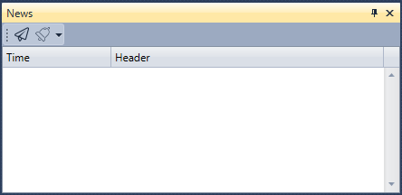

# News

The **News** component displays news received from connections.

To start receiving news, click the **Receive news** button

The News panel has the ability to configure notifications for selected events – [Notification settings](Designer_notification_Setting.md).

## Recommended content

[Positions (options)](Terminal_options_positions.md)
