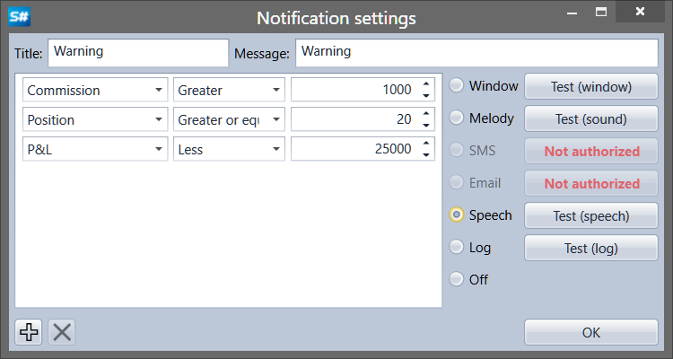

# Notifications setup

To set a notification, you have to click the  button in the notification panel ([Notification panel](Terminal_Notifications_Panel.md)) or click the  button directly in the panels that support notifications ([Portfolios](Terminal_Panel_Portfolios.md), [Trades feed](Terminal_Tape_Trades.md), [News](Terminal_news.md), [Level 1](Terminal_level1.md)).

Notification can be configure for change of the following data types: Portfolio, Customer code, Broker, Depository, Server time, Trade, Data type, Cancellation, Order ID, Order ID (string), Order ID (board), Derivative, Derivative (string), Price, Volume (order), Volume (trade), Visible volume, Direction, Remainder, Order type, Status, Comment, Message to order, System order, Order expiration time, Execution condition, Oder ID, Order ID (string), Price, Trade initiator, Open interest, Error, Condition, Uptrend, Commission, Delay, Slippage, ID (user), Currency, P\/L, Position, Market Maker.

Notifications can be of the following form:

- **Window** – small pop\-up window with a message will appear the screen corner.
- **Melody** – a melody will be played.
- **SMS** – message will be sent using sms.
- **Email** – message will be emailed.
- **Speech** – message will be spoken by the computer generated voice.
- **Log** – message will be sent to the Designer logs window.
- **Off** – notification will not be shown.

## Recommended content
