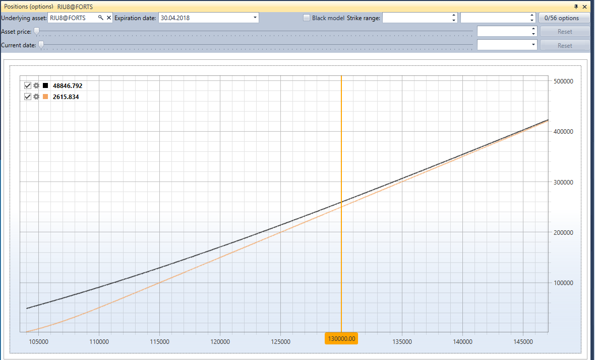

# Positions (options)

**Positions (options)** is a graphic display of the position by options.

To display the position by options, you have to select the underlying asset and options based on the prices of which the position will be built.

In addition, you can specify a filter for the exact expiration date of options and filters for minimum\/maximum strikes.

## Recommended content

[Option desk](Terminal_option_desk.md)
