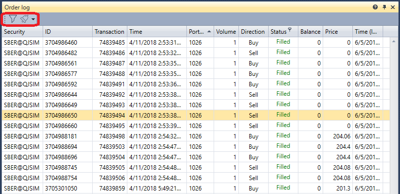

# Order log

The **Order log** component is a table with orders that displays complete information about all orders for the selected instruments.

The **Order log** has a filter for selecting the necessary instruments. It is also possible to configure notifications for events of the selected instruments \- [Notification settings](Terminal_Notifications.md).

## Recommended content

[Market data storage](Terminal_Repository_of_market_data.md)
