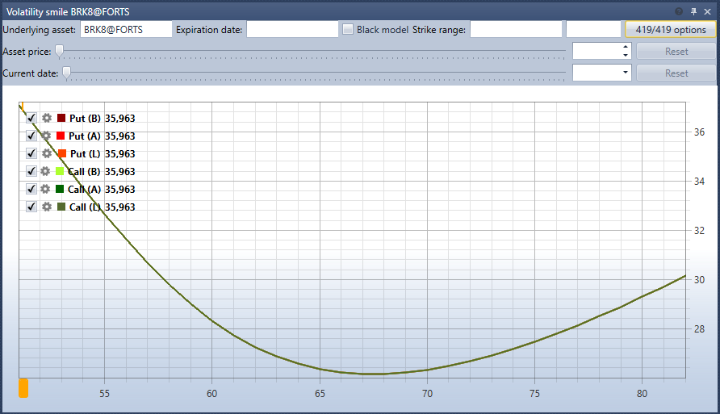

# Smile volatility

The **Smile volatility** component is a graphic representation of the expected volatility level for options with the same underlying asset and different strikes.

To display the volatility smile, you have to select the underlying asset and options based on the prices of which the volatility smile will be built.

In addition, you can specify a filter for the exact expiration date of options and filters for minimum\/maximum strikes.

## Recommended content

[Order log](Terminal_orderlog.md)
