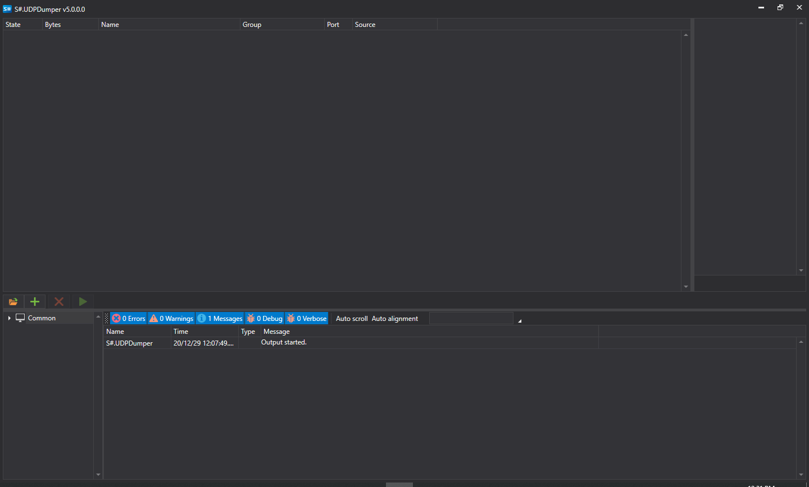
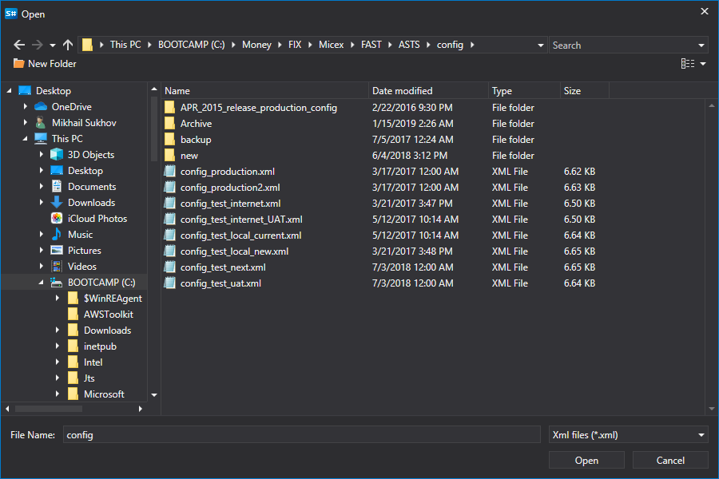
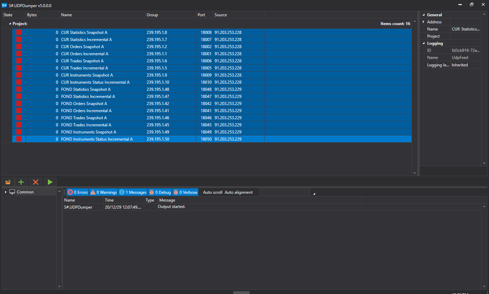
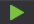
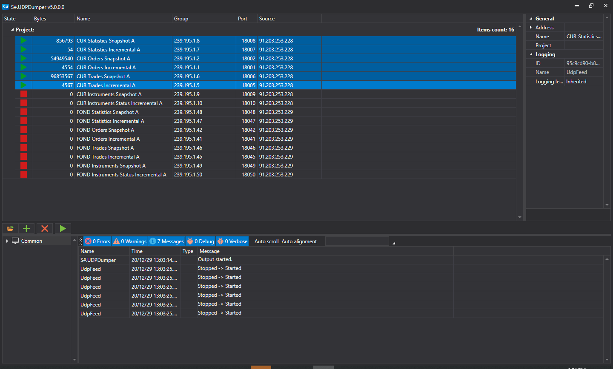

# S\#.UDP Dumper

The app **S\#.UDPDumper** is designed to accumulate UDP packets. Using this program, you can check the valid of the network settings made by a broker or exchange. And also, accumulate data for further tests of the connector.

To install need use [S\#.Installer](SharpInstaller.md).

## Setup and run

1. On first launch, the app shows the following:
2. To add network feeds, you can add both manually and automatically load all feeds from the config files of exchanges. To do this, click on the button:
3. In the window that appears, you need to find the desired config file from the exchange and open it:
4. All feeds with IP addresses and ports settings will be loaded from a file:
5. It is necessary to select the necessary feeds, and click on the download start button:
6. В случае успешных настроек программа начнет получать UDP датаграммы и записывать на диск. Программа будет писать кол\-во полученных байтов для каждого потока:

   > [!CAUTION]
   > If the settings are successful, the program will start receiving UDP datagrams and writing them to disk. The app will write the number of bytes received for each feed.
7. The app **S\#.UDPDumper** is written with a graphical interface. If the program is launched without a graphical interface (as well as running under Linux operating systems, etc.) you can use the **S\#.UDPDumper.Console**, program, which is a console and cross\-platform version.

   The app **S\#.UDPDumper.Console** takes as a parameter the path to the file created by the UI version (exactly the UI version, and **not an exchange config**):

   ```cs
   		StockSharp.UdpDumper.Console.exe settings.xml
   		
   ```
8. To test on the accumulated data of the connector, you can use the dump mode. More details [Dump mode](FastDump.md).
