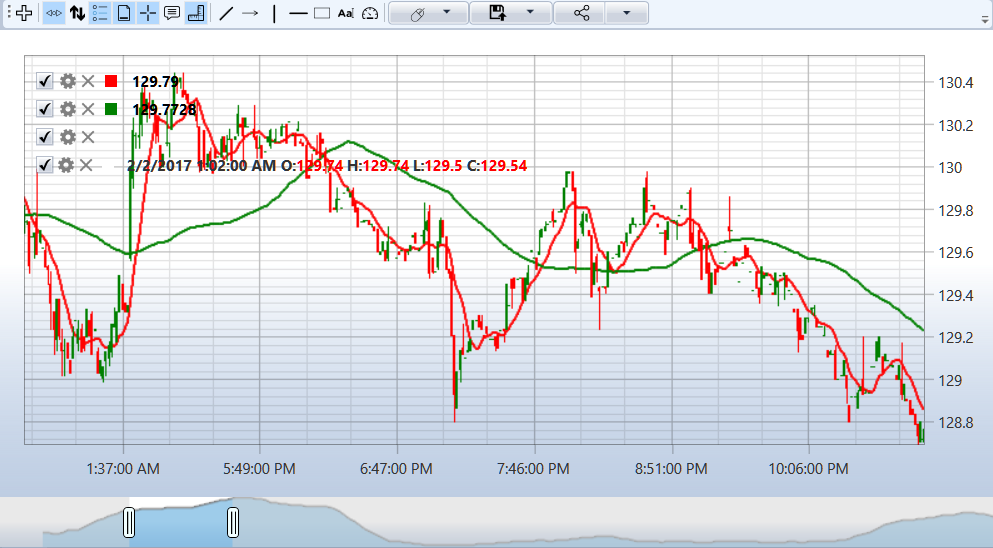

# Chart

For graphical display of candles, you can use the special [Chart](xref:StockSharp.Xaml.Charting.Chart) component (see [Components for building charts](../graphical_user_interface/charts.md)), which renders candles as follows:



## Basic Approach to Displaying Candles

There are two approaches to displaying candles on a chart. The first approach is manual drawing of candles when receiving data:

```cs
// CandlesChart - StockSharp.Xaml.Chart
private ChartArea _areaComb;
private ChartCandleElement _candleElement;

// Chart initialization
private void InitializeChart()
{
    // Create chart area
    _areaComb = new ChartArea();
    _chart.Areas.Add(_areaComb);
    
    // Create chart element representing candles
    _candleElement = new ChartCandleElement() { FullTitle = "Candles" };
    _areaComb.Elements.Add(_candleElement);
    
    // Subscribe to candle reception event
    _connector.CandleReceived += OnCandleReceived;
}

// Create subscription to 5-minute candles
private void SubscribeToCandles()
{
    var subscription = new Subscription(
        DataType.TimeFrame(TimeSpan.FromMinutes(5)),
        _security)
    {
        MarketData = 
        {
            // Request historical data for 5 days
            From = DateTime.Today.Subtract(TimeSpan.FromDays(5)),
            To = DateTime.Now
        }
    };
    
    // Start subscription
    _connector.Subscribe(subscription);
}

// Handler for candle reception event
private void OnCandleReceived(Subscription subscription, ICandleMessage candle)
{
    // Check if the candle is completed
    if (candle.State == CandleStates.Finished) 
    {
        // Create data for drawing
        var chartData = new ChartDrawData();
        chartData.Group(candle.OpenTime).Add(_candleElement, candle);
        
        // Draw on chart in UI thread
        this.GuiAsync(() => _chart.Draw(chartData));
    }
}
```

## Automatic Binding of Subscription to Chart Element

The second approach is to use automatic binding of subscription to chart element. This allows automatically displaying the received data:

```cs
// Chart initialization with automatic binding
private void InitializeChartWithAutoBinding()
{
    // Create chart area
    var area = new ChartArea();
    _chart.Areas.Add(area);
    
    // Create element for displaying candles
    var candleElement = new ChartCandleElement();
    
    // Create subscription to candles
    var subscription = new Subscription(
        DataType.TimeFrame(TimeSpan.FromMinutes(5)),
        _security)
    {
        MarketData = 
        {
            From = DateTime.Today.Subtract(TimeSpan.FromDays(5)),
            To = DateTime.Now
        }
    };
    
    // Bind element to subscription
    _chart.AddElement(area, candleElement, subscription);
    
    // Start subscription
    _connector.Subscribe(subscription);
}
```

## Working with Indicators

To display indicators on the chart together with candles, elements of type [ChartIndicatorElement](xref:StockSharp.Xaml.Charting.ChartIndicatorElement) are used:

```cs
// Adding indicator to chart
private void AddIndicatorToChart()
{
    // Create element for indicator
    var smaElement = new ChartIndicatorElement
    {
        Title = "SMA (14)",
        Color = Colors.Red
    };
    
    // Add element to the same area as candles
    _areaComb.Elements.Add(smaElement);
    
    // Create indicator
    var sma = new SimpleMovingAverage { Length = 14 };
    
    // Subscribe to candle reception event for indicator calculation
    _connector.CandleReceived += (subscription, candle) =>
    {
        // Calculate indicator value
        var indicatorValue = sma.Process(candle);
        
        // Draw value on chart
        var chartData = new ChartDrawData();
        chartData.Group(candle.OpenTime).Add(smaElement, indicatorValue);
        
        this.GuiAsync(() => _chart.Draw(chartData));
    };
}
```

## Displaying Multiple Indicators on Different Areas

Indicators can be placed on separate chart areas:

```cs
// Adding indicators to different areas
private void AddIndicatorsToSeparateAreas()
{
    // Main area for candles
    var candleArea = new ChartArea();
    _chart.Areas.Add(candleArea);
    
    // Element for candles
    var candleElement = new ChartCandleElement();
    candleArea.Elements.Add(candleElement);
    
    // Element for SMA on the same area
    var smaElement = new ChartIndicatorElement { Title = "SMA (14)" };
    candleArea.Elements.Add(smaElement);
    
    // Separate area for RSI
    var rsiArea = new ChartArea();
    _chart.Areas.Add(rsiArea);
    
    // Element for RSI
    var rsiElement = new ChartIndicatorElement { Title = "RSI (14)" };
    rsiArea.Elements.Add(rsiElement);
    
    // Create indicators
    var sma = new SimpleMovingAverage { Length = 14 };
    var rsi = new RelativeStrengthIndex { Length = 14 };
    
    // Subscription to candles
    var subscription = new Subscription(
        DataType.TimeFrame(TimeSpan.FromMinutes(5)),
        _security);
    
    // Bind candle element to subscription
    _chart.AddElement(candleArea, candleElement, subscription);
    
    // Start subscription and process indicators
    _connector.Subscribe(subscription);
    
    _connector.CandleReceived += (sub, candle) =>
    {
        if (sub != subscription || candle.State != CandleStates.Finished)
            return;
        
        // Calculate indicator values
        var smaValue = sma.Process(candle);
        var rsiValue = rsi.Process(candle);
        
        // Draw values on chart
        var chartData = new ChartDrawData();
        chartData
            .Group(candle.OpenTime)
                .Add(smaElement, smaValue)
                .Add(rsiElement, rsiValue);
        
        this.GuiAsync(() => _chart.Draw(chartData));
    };
}
```

## Displaying Orders and Trades on Chart

Special elements are used to display orders and trades on the chart:

```cs
// Adding elements for displaying orders and trades
private void AddOrdersAndTradesToChart()
{
    // Create elements for displaying orders and trades
    var orderElement = new ChartOrderElement();
    var tradeElement = new ChartTradeElement();
    
    // Add elements to chart area
    _areaComb.Elements.Add(orderElement);
    _areaComb.Elements.Add(tradeElement);
    
    // Subscribe to order and trade reception events
    _connector.OrderReceived += (subscription, order) =>
    {
        if (order.Security != _security)
            return;
        
        // Draw order on chart
        var chartData = new ChartDrawData();
        chartData.Group(order.Time).Add(orderElement, order);
        
        this.GuiAsync(() => _chart.Draw(chartData));
    };
    
    _connector.OwnTradeReceived += (subscription, trade) =>
    {
        if (trade.Order.Security != _security)
            return;
        
        // Draw trade on chart
        var chartData = new ChartDrawData();
        chartData.Group(trade.Time).Add(tradeElement, trade);
        
        this.GuiAsync(() => _chart.Draw(chartData));
    };
}
```

## Configuring Chart Appearance

Various aspects of chart appearance can be configured:

```cs
// Configuring chart appearance
private void ConfigureChartAppearance()
{
    // Configuring chart area
    _areaComb.Height = 300;
    _areaComb.BackgroundMajorGridColor = Colors.Gray;
    _areaComb.BackgroundMinorGridColor = Colors.LightGray;
    
    // Configuring candle element
    _candleElement.DrawStyle = ChartCandleDrawStyles.CandleStick;
    _candleElement.UpBrush = Brushes.Green;
    _candleElement.DownBrush = Brushes.Red;
    _candleElement.StrokeThickness = 1;
    
    // Configuring entire chart
    _chart.IsAutoRange = true;            // Automatic scaling
    _chart.IsManualVerticalValues = false; // Automatic calculation of vertical values
    _chart.BidEnabled = false;            // Disable display of best bid price
    _chart.AskEnabled = false;            // Disable display of best ask price
}
```

## Chart Zooming and Scrolling

Managing chart zoom and scroll:

```cs
// Configuring zooming and scrolling
private void ConfigureChartZoomAndScroll()
{
    // Setting initial and final dates for display
    _chart.SetXRange(DateTime.Today.AddDays(-10), DateTime.Today);
    
    // Setting Y-axis range
    _chart.SetYRange(100, 150);
    
    // Buttons for zoom control
    zoomInButton.Click += (s, e) => _chart.ZoomIn();
    zoomOutButton.Click += (s, e) => _chart.ZoomOut();
    
    // Buttons for scrolling
    scrollLeftButton.Click += (s, e) => _chart.ScrollLeft();
    scrollRightButton.Click += (s, e) => _chart.ScrollRight();
    
    // Reset zoom to automatic
    resetZoomButton.Click += (s, e) => _chart.IsAutoRange = true;
}
```

## Exporting Chart to Image

To save chart to a file:

```cs
// Exporting chart to image
private void ExportChartToImage()
{
    // Create object for saving image
    var saveFileDialog = new SaveFileDialog
    {
        Filter = "PNG Image|*.png|JPEG Image|*.jpg|BMP Image|*.bmp",
        Title = "Save Chart Image"
    };
    
    if (saveFileDialog.ShowDialog() == true)
    {
        // Create image from chart
        var rtb = new RenderTargetBitmap(
            (int)_chart.ActualWidth, 
            (int)_chart.ActualHeight, 
            96, 96, 
            PixelFormats.Pbgra32);
        
        rtb.Render(_chart);
        
        // Save image in selected format
        BitmapEncoder encoder;
        
        switch (Path.GetExtension(saveFileDialog.FileName).ToLower())
        {
            case ".jpg":
                encoder = new JpegBitmapEncoder();
                break;
            case ".bmp":
                encoder = new BmpBitmapEncoder();
                break;
            default:
                encoder = new PngBitmapEncoder();
                break;
        }
        
        encoder.Frames.Add(BitmapFrame.Create(rtb));
        
        using (var fileStream = new FileStream(saveFileDialog.FileName, FileMode.Create))
        {
            encoder.Save(fileStream);
        }
    }
}
```

## Clearing the Chart

To clear data on the chart:

```cs
// Clearing chart or its elements
private void ClearChart()
{
    // Clear entire chart
    _chart.Reset();
    
    // Clear specific area
    _areaComb.Reset();
    
    // Clear specific element
    _candleElement.Reset();
}
```

An example of displaying candles on a chart is provided in the [Candles](../candles.md) section.

## See also

[Components for building charts](../graphical_user_interface/charts.md)