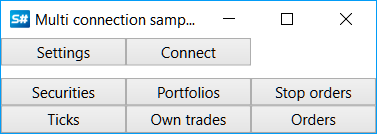

# Connectors

For working with exchanges and data sources in [S#](../api.md), it is recommended to use the base class [Connector](xref:StockSharp.Algo.Connector).

Let's look at working with [Connector](xref:StockSharp.Algo.Connector). The source code of the example can be found in the Samples/Common/SampleConnection project.



Create an instance of the [Connector](xref:StockSharp.Algo.Connector) class:

```cs
...
public Connector Connector;
...
public MainWindow()
{
    InitializeComponent();
    Connector = new Connector();
    InitConnector();
}
		
```

For configuring [Connector](xref:StockSharp.Algo.Connector), the **API** has a special graphical interface that allows you to configure multiple connections simultaneously. How to use it is described in the section [Graphical Configuration](connectors/graphical_configuration.md).

```cs
...
private const string _connectorFile = "ConnectorFile.json";
...
private void Setting_Click(object sender, RoutedEventArgs e)
{
    if (Connector.Configure(this))
    {
        Connector.Save().Serialize(_connectorFile);
    }
}
	  				
```


Similarly, you can add connections directly from code (without graphical windows) by using the extension method [TraderHelper.AddAdapter\<TAdapter\>](xref:StockSharp.Algo.TraderHelper.AddAdapter``1(StockSharp.Algo.Connector,System.Action{``0}))**(**[StockSharp.Algo.Connector](xref:StockSharp.Algo.Connector) connector, [System.Action\<TAdapter\>](xref:System.Action`1) init **)**:

```cs
...
// Add adapter for connecting to Binance
connector.AddAdapter<BinanceMessageAdapter>(a => 
{
    a.Key = "<Your API Key>";
    a.Secret = "<Your Secret Key>";
});

// Add RSS for news
connector.AddAdapter<RssMessageAdapter>(a => 
{
    a.Address = "https://news-source.com/feed";
    a.IsEnabled = true;
});
	  				
```

You can add an unlimited number of connections to a single [Connector](xref:StockSharp.Algo.Connector) object. Therefore, you can connect to multiple exchanges and brokers simultaneously from the program.

In the *InitConnector* method, we set the required event handlers for [IConnector](xref:StockSharp.BusinessEntities.IConnector):

```cs
private void InitConnector()
{
    // Subscribe to successful connection event
    Connector.Connected += () =>
    {
        this.GuiAsync(() => ChangeConnectStatus(true));
    };
    
    // Subscribe to connection error event
    Connector.ConnectionError += error => this.GuiAsync(() =>
    {
        ChangeConnectStatus(false);
        MessageBox.Show(this, error.ToString(), LocalizedStrings.Str2959);
    });
    
    // Subscribe to disconnection event
    Connector.Disconnected += () => this.GuiAsync(() => ChangeConnectStatus(false));
    
    // Subscribe to error event
    Connector.Error += error =>
        this.GuiAsync(() => MessageBox.Show(this, error.ToString(), LocalizedStrings.Str2955));
    
    // Subscribe to market data subscription failure event
    Connector.SubscriptionFailed += (subscription, error) =>
        this.GuiAsync(() => MessageBox.Show(this, error.ToString(), 
            LocalizedStrings.Str2956Params.Put(subscription.DataType, subscription.SecurityId)));
    
    // Subscriptions for data reception
    
    // Instruments
    Connector.SecurityReceived += (sub, security) => _securitiesWindow.SecurityPicker.Securities.Add(security);
    
    // Tick trades
    Connector.TickTradeReceived += (sub, trade) => _tradesWindow.TradeGrid.Trades.TryAdd(trade);
    
    // Orders
    Connector.OrderReceived += (sub, order) => _ordersWindow.OrderGrid.Orders.TryAdd(order);
    
    // Own trades
    Connector.OwnTradeReceived += (sub, trade) => _myTradesWindow.TradeGrid.Trades.TryAdd(trade);
    
    // Positions
    Connector.PositionReceived += (sub, position) => _portfoliosWindow.PortfolioGrid.Positions.TryAdd(position);

    // Order registration failures
    Connector.OrderRegisterFailReceived += (sub, fail) => _ordersWindow.OrderGrid.AddRegistrationFail(fail);
    
    // Order cancellation failures
    Connector.OrderCancelFailReceived += (sub, fail) => OrderFailed(fail);
    
    // Set market data provider
    _securitiesWindow.SecurityPicker.MarketDataProvider = Connector;
    
    try
    {
        if (File.Exists(_connectorFile))
        {
            var ctx = new ContinueOnExceptionContext();
            ctx.Error += ex => ex.LogError();
            using (new Scope<ContinueOnExceptionContext>(ctx))
                Connector.Load(_connectorFile.Deserialize<SettingsStorage>());
        }
    }
    catch
    {
    }
    
    ConfigManager.RegisterService<IExchangeInfoProvider>(new InMemoryExchangeInfoProvider());
    
    // Register adapter provider for graphical configuration
    ConfigManager.RegisterService<IMessageAdapterProvider>(
        new FullInMemoryMessageAdapterProvider(Connector.Adapter.InnerAdapters));
}
```

How to save and load settings for [Connector](xref:StockSharp.Algo.Connector) to a file can be found in the section [Saving and Loading Settings](connectors/save_and_load_settings.md).

Information about creating your own [Connector](xref:StockSharp.Algo.Connector) can be found in the section [Creating Your Own Connector](connectors/creating_own_connector.md).

Order placement is described in the sections [Orders](orders_management.md), [Creating a New Order](orders_management/create_new_order.md), [Creating a New Stop Order](orders_management/create_new_stop_order.md).

## See Also

[Graphical Configuration](connectors/graphical_configuration.md)