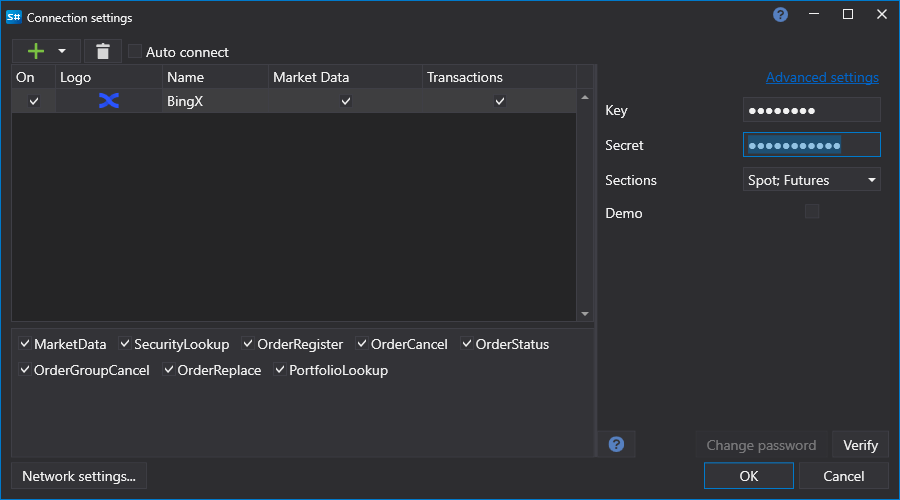

# Graphical Configuration of BingX

For all [S#](../../../../api.md) products, graphical configuration of the connection is performed in the [Connection Settings Window](../../../graphical_user_interface/connection_settings_window.md):

- **Key** - Key.
- **Secret** - Secret.
- **Demo** - Demo mode.
- **Reconnection settings** - Parameters of the reconnection mechanism with the trading system ([Reconnection settings](../../reconnection_settings.md)).
