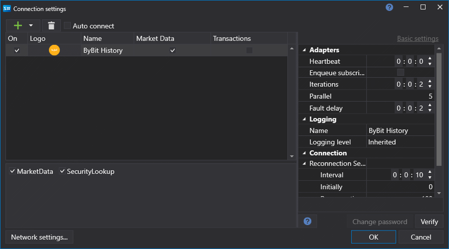

# Graphical configuration Bybit History

For all [S#](../../../../api.md) products, graphical configuration of the connection is performed on the [Connection settings window](../../../graphical_user_interface/connection_settings_window.md):

The window does not expose Bybit History-specific options.
