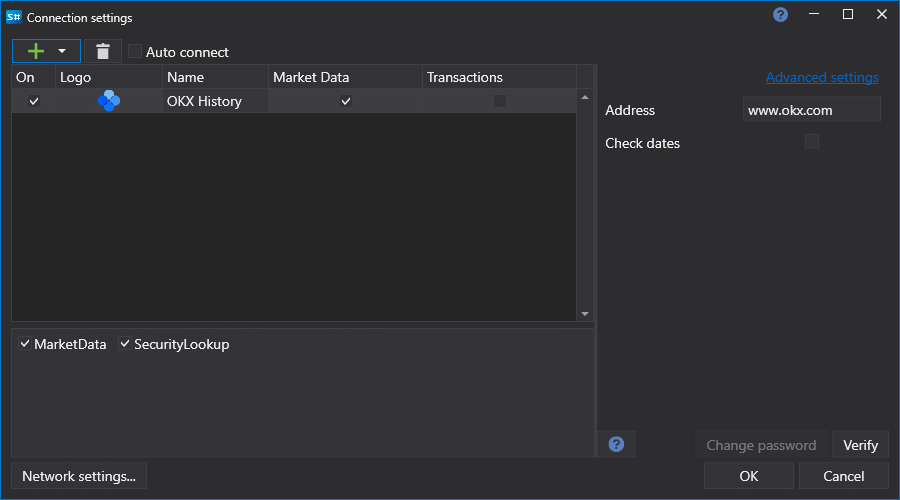

# Graphical configuration OKEx History

For all [S#](../../../../api.md) products, graphical configuration of the connection is performed on the [Connection settings window](../../../graphical_user_interface/connection_settings_window.md):

- **Check dates** - Validate requested dates before sending download requests.
