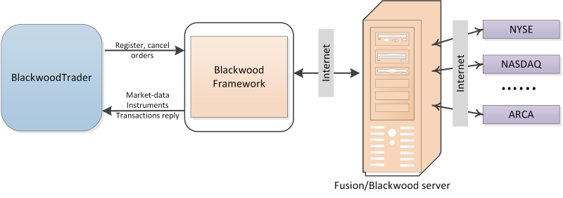

# Configuration Blackwood (Fusion)

To work with a connector, you have to specify the **Login** and **Password**. **Login** and **Password** are provided by the broker. To get the API access it is recommended to contact the broker.

The interaction mechanism is shown in this figure: 

