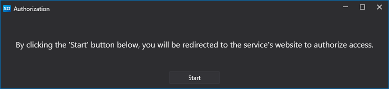

# Graphical configuration of Tradier

For all StockSharp products, graphical connection setup is performed in the [Connection settings window](../../../graphical_user_interface/connection_settings_window.md) screen form:

- **Token** - Authorization token.
- **Demo** - Demo mode.

OAuth Authorization:

1. You can directly insert the token into the "Token" field.
2. If you leave the token field empty and the "Demo" mode is not selected, OAuth authorization will be used.

OAuth authorization process:

1. When you click the "Check" button, a window will open:

   

2. After clicking "Start", the user will be redirected to the Tradier website to log in:

   

3. On the Tradier website, you need to allow the StockSharp application access to trading operations:

   

4. After that, you will be redirected back to the StockSharp website, and the program will automatically log in.

## See also

[Connectors](../../../connectors.md)

[OAuth](../../oauth.md)

[Graphical configuration](../../graphical_configuration.md)

[Creating your own connector](../../creating_own_connector.md)

[Saving and loading settings](../../save_and_load_settings.md)