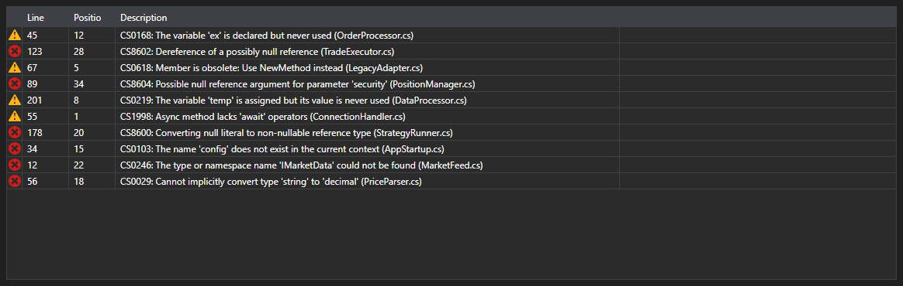

# Compilation errors



[ErrorsGrid](xref:StockSharp.Xaml.Code.ErrorsGrid) - a table of compilation errors. For every [CompilationError](xref:Ecng.Compilation.CompilationError) entry it shows the kind (error, warning, message), the line, the position in the line and the text.

**Main properties**

- [ErrorsGrid.Errors](xref:StockSharp.Xaml.Code.ErrorsGrid.Errors) - list of compilation errors.

The `ErrorSelected` event is raised on a double click on a row \- the code editor uses it to move the caret to that line. This is how the table and the editor form the usual pair of an error list and a jump to the error.

Below are code snippets showing its usage:

```xaml
<Window x:Class="Sample.CompilationWindow"
	xmlns="http://schemas.microsoft.com/winfx/2006/xaml/presentation"
	xmlns:x="http://schemas.microsoft.com/winfx/2006/xaml"
	xmlns:code="clr-namespace:StockSharp.Xaml.Code;assembly=StockSharp.Xaml"
	Height="200" Width="800">
	<code:ErrorsGrid x:Name="ErrorsGrid" />
</Window>
```

```cs
// Show the compilation result
var result = compiler.Compile("Strategy", sources, references);

ErrorsGrid.Errors.Clear();
ErrorsGrid.Errors.AddRange(result.Errors);

// Jump to the line with the error on a double click
ErrorsGrid.ErrorSelected += error => CodePanel.Code.SelectLine(error.Line);
```

## See also

[Diagnostics](../diagnostics.md)
