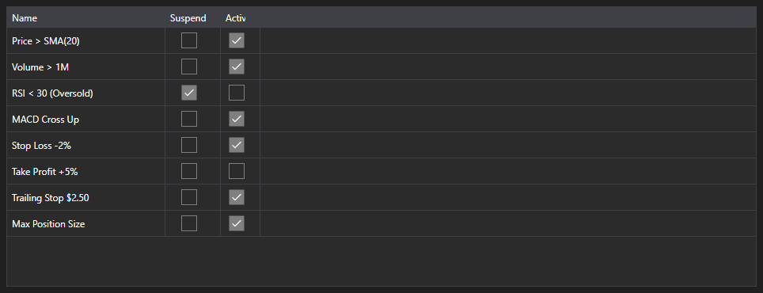

# Active rules



[MarketRuleGrid](xref:StockSharp.Xaml.MarketRuleGrid) - a table of [IMarketRule](xref:StockSharp.Algo.IMarketRule) rules created by a strategy or a connector. It shows the rule name, the suspended flag and the active flag.

**Main properties**

- [MarketRuleGrid.Rules](xref:StockSharp.Xaml.MarketRuleGrid.Rules) - list of rules; usually [Strategy.Rules](xref:StockSharp.Algo.Strategies.Strategy.Rules).

The table is needed where there are many rules and you have to tell which ones are still alive. A rule disappears from the list once it has fired and been removed, so a leak is visible at once: a rule that should have been removed but stayed.

Below are code snippets showing its usage:

```xaml
<Window x:Class="Sample.RulesWindow"
	xmlns="http://schemas.microsoft.com/winfx/2006/xaml/presentation"
	xmlns:x="http://schemas.microsoft.com/winfx/2006/xaml"
	xmlns:xaml="http://schemas.stocksharp.com/xaml"
	Height="300" Width="600">
	<xaml:MarketRuleGrid x:Name="RuleGrid" />
</Window>
```

```cs
// Show the rules of the strategy
RuleGrid.Rules = _strategy.Rules;

// Every created rule appears in the table
_strategy
	.WhenPositionChanged()
	.Do(() => LogInfo("position={0}", _strategy.Position))
	.Apply(_strategy);
```

## See also

[Diagnostics](../diagnostics.md)
