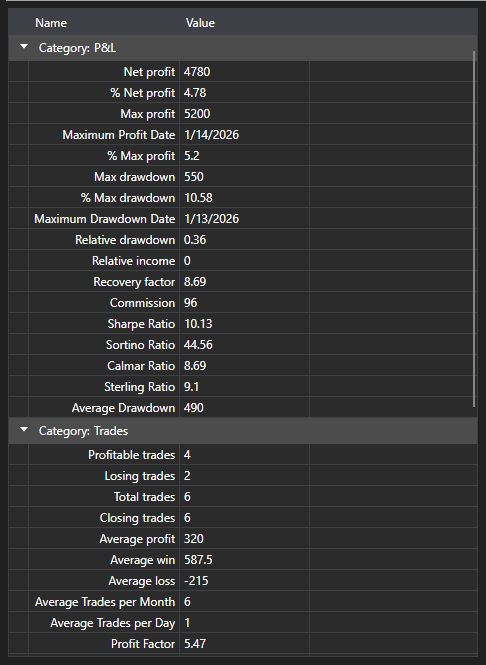

# Strategy statistics



[StatisticParameterGrid](xref:StockSharp.Xaml.StatisticParameterGrid) - a table of the [IStatisticParameter](xref:StockSharp.Algo.Statistics.IStatisticParameter) statistics parameters of a single strategy. The parameters are grouped by category (trades, orders, return, drawdown), and every row shows the name, the current value and the description.

**Main properties and methods**

- [StatisticParameterGrid.StatisticManager](xref:StockSharp.Xaml.StatisticParameterGrid.StatisticManager) - the statistics manager whose parameters the table shows. Usually it is [Strategy.StatisticManager](xref:StockSharp.Algo.Strategies.Strategy.StatisticManager).
- [StatisticParameterGrid.Parameters](xref:StockSharp.Xaml.StatisticParameterGrid.Parameters) - the list of parameters, when it is set directly rather than through the manager.
- [StatisticParameterGrid.Reset](xref:StockSharp.Xaml.StatisticParameterGrid.Reset) - resets the accumulated values.

The values are updated as the strategy runs, so the table is placed next to the chart: the chart shows how the trading went, the table shows what it cost. Before running the same calculation again you have to call `Reset`, otherwise the new values will be laid over the old ones.

Unlike [StrategiesStatisticsPanel](xref:StockSharp.Xaml.StrategiesStatisticsPanel), which compares several strategies over the same columns, this table breaks down one strategy in full.

Below are code snippets showing its usage:

```xaml
<Window x:Class="Sample.StatisticsWindow"
	xmlns="http://schemas.microsoft.com/winfx/2006/xaml/presentation"
	xmlns:x="http://schemas.microsoft.com/winfx/2006/xaml"
	xmlns:xaml="http://schemas.stocksharp.com/xaml"
	Height="500" Width="400">
	<xaml:StatisticParameterGrid x:Name="StatisticGrid" />
</Window>
```

```cs
// Show the statistics of the strategy
StatisticGrid.StatisticManager = _strategy.StatisticManager;

// Reset the accumulated values before running again
StatisticGrid.Reset();
```

## See also

[Diagnostics](../diagnostics.md)

[Statistics](../strategies/statistics.md)
