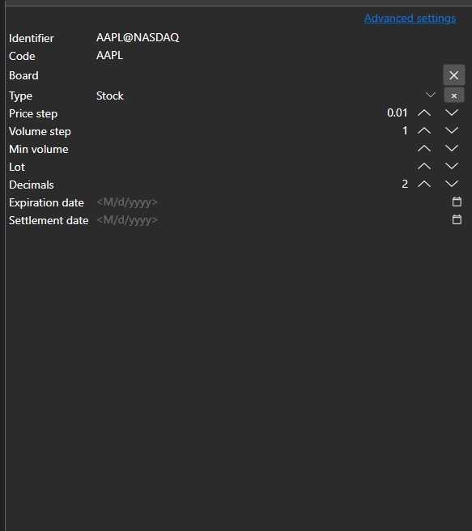
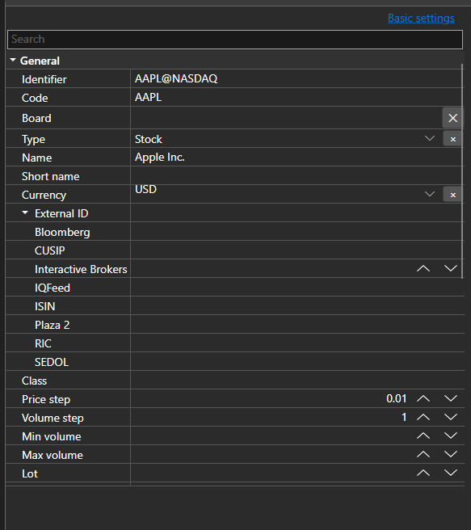

# Basic and advanced properties





[BasicAdvPropertiesPanel](xref:StockSharp.Xaml.PropertyGrid.BasicAdvPropertiesPanel) - a property panel with two modes. The basic mode shows a short list of required fields, the advanced one shows all properties of the object grouped by categories.

**Main properties**

- [BasicAdvPropertiesPanel.SelectedObject](xref:StockSharp.Xaml.PropertyGrid.BasicAdvPropertiesPanel.SelectedObject) - edited object.
- [BasicAdvPropertiesPanel.IsAdvancedMode](xref:StockSharp.Xaml.PropertyGrid.BasicAdvPropertiesPanel.IsAdvancedMode) - advanced mode flag.
- [BasicAdvPropertiesPanel.PlainMaxDepth](xref:StockSharp.Xaml.PropertyGrid.BasicAdvPropertiesPanel.PlainMaxDepth) - expansion depth of nested properties in the basic mode.
- [BasicAdvPropertiesPanel.PostImmediately](xref:StockSharp.Xaml.PropertyGrid.BasicAdvPropertiesPanel.PostImmediately) - apply the value while typing instead of waiting for the focus to leave the field.

The two modes solve the usual problem of connector settings: there are three or four required fields and several dozen properties in total. The basic mode shows only what the connection cannot work without; everything else stays available in the advanced mode.

Below are code snippets showing its usage:

```xaml
<Window x:Class="Sample.SettingsWindow"
	xmlns="http://schemas.microsoft.com/winfx/2006/xaml/presentation"
	xmlns:x="http://schemas.microsoft.com/winfx/2006/xaml"
	xmlns:pg="clr-namespace:StockSharp.Xaml.PropertyGrid;assembly=StockSharp.Xaml"
	Height="500" Width="400">
	<pg:BasicAdvPropertiesPanel x:Name="PropertiesPanel" />
</Window>
```

```cs
// Show the adapter properties
PropertiesPanel.SelectedObject = _adapter;

// Switch to the advanced mode
PropertiesPanel.IsAdvancedMode = true;

// Mark the settings as changed
PropertiesPanel.CellValueChanged += (sender, e) => _isModified = true;
```

## See also

[Value editors](../editors.md)
