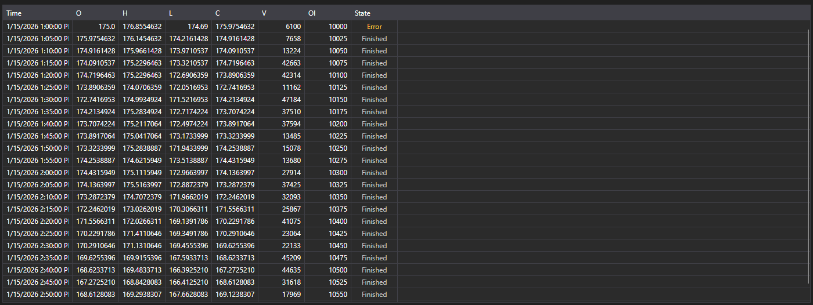

# Candles



[CandleMessageGrid](xref:StockSharp.Xaml.CandleMessageGrid) - a candle table. It shows the open, high, low and close prices, the volumes, the open interest and the state of every candle.

**Main properties**

- [CandleMessageGrid.Messages](xref:StockSharp.Xaml.CandleMessageGrid.Messages) - list of candles.
- [CandleMessageGrid.SelectedMessage](xref:StockSharp.Xaml.CandleMessageGrid.SelectedMessage) - selected candle.
- [CandleMessageGrid.SelectedMessages](xref:StockSharp.Xaml.CandleMessageGrid.SelectedMessages) - selected candles.

## Candle states

The **State** column is coloured by the [CandleStates](xref:StockSharp.Messages.CandleStates) value, and the screenshot shows all three:

- **Active** - the candle is still forming. It is highlighted because its values keep changing: such a candle must not be read as a closed one.
- **Finished** - the candle is closed and its values are final. A neutral colour, and most rows in the table are this.
- **None** - no state arrived. The table labels it **Error** and tones it as a warning: this is not an empty value but a sign that the data came in incomplete.

So a candle subscription showing **Error** in its first row is reporting a problem with the data source, not a candle without a state.

Below are code fragments demonstrating its usage:

```xaml
<Window x:Class="Sample.CandlesWindow"
	xmlns="http://schemas.microsoft.com/winfx/2006/xaml/presentation"
	xmlns:x="http://schemas.microsoft.com/winfx/2006/xaml"
	xmlns:xaml="http://schemas.stocksharp.com/xaml"
	Title="Candles" Height="400" Width="800">
	<xaml:CandleMessageGrid x:Name="CandleGrid" x:FieldModifier="public" />
</Window>
```

```cs
public class CandlesWindow
{
	private readonly Connector _connector;
	private readonly Security _security;
	private Subscription _candleSubscription;

	public CandlesWindow(Connector connector, Security security)
	{
		InitializeComponent();

		_connector = connector;
		_security = security;

		// Subscribe to the candle received event
		_connector.CandleReceived += OnCandleReceived;

		// Create a subscription to five-minute candles
		_candleSubscription = new Subscription(TimeSpan.FromMinutes(5).TimeFrame(), security);

		// Start the subscription
		_connector.Subscribe(_candleSubscription);
	}

	// Candle received handler
	private void OnCandleReceived(Subscription subscription, ICandleMessage candle)
	{
		// Check that the candle belongs to our subscription
		if (subscription != _candleSubscription)
			return;

		// Add the candle to the table on the user interface thread
		this.GuiAsync(() => CandleGrid.Messages.Add((CandleMessage)candle));
	}

	// Unsubscribe when the window closes
	public void Unsubscribe()
	{
		if (_candleSubscription != null)
		{
			_connector.CandleReceived -= OnCandleReceived;
			_connector.UnSubscribe(_candleSubscription);
			_candleSubscription = null;
		}
	}
}
```

### Finished candles only

Until a candle closes it arrives many times, so the table grows on every update. When only the final values matter, filter by state:

```cs
private void OnCandleReceived(Subscription subscription, ICandleMessage candle)
{
	if (subscription != _candleSubscription)
		return;

	// Skip everything that is still forming
	if (candle.State != CandleStates.Finished)
		return;

	this.GuiAsync(() => CandleGrid.Messages.Add((CandleMessage)candle));
}
```

### Updating the current candle in place

To keep the current candle in the table and update it instead of adding it again, replace the last row until the candle closes:

```cs
private void OnCandleReceived(Subscription subscription, ICandleMessage candle)
{
	if (subscription != _candleSubscription)
		return;

	var message = (CandleMessage)candle;

	this.GuiAsync(() =>
	{
		var last = CandleGrid.Messages.LastOrDefault();

		// The same candle as the last row - replace it
		if (last != null && last.OpenTime == message.OpenTime)
			CandleGrid.Messages[CandleGrid.Messages.Count - 1] = message;
		else
			CandleGrid.Messages.Add(message);
	});
}
```

### Loading historical candles

```cs
// Load historical candles
public void LoadHistoricalCandles(Security security, TimeSpan timeFrame, DateTime from, DateTime to)
{
	// Clear the current candles
	CandleGrid.Messages.Clear();

	// Create a subscription to historical candles
	var historySubscription = new Subscription(timeFrame.TimeFrame(), security)
	{
		MarketData =
		{
			// Set the period the historical data is requested for
			From = from,
			To = to
		}
	};

	_connector.CandleReceived += OnCandleReceived;
	_connector.Subscribe(historySubscription);
}
```

## See also

[Tick Trades](ticks.md)
