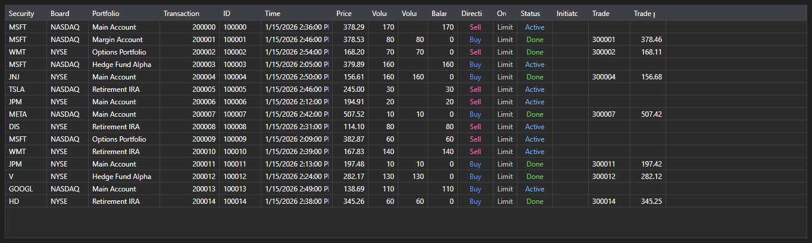

# Transactions and trades



[ExecutionGrid](xref:StockSharp.Xaml.ExecutionGrid) - a universal table of [ExecutionMessage](xref:StockSharp.Messages.ExecutionMessage) messages. A single control shows tick trades, order log and own transactions \- the kind of data is set by [ExecutionMessage.DataTypeEx](xref:StockSharp.Messages.ExecutionMessage.DataTypeEx).

**Main properties**

- [ExecutionGrid.Messages](xref:StockSharp.Xaml.ExecutionGrid.Messages) - list of messages.
- [ExecutionGrid.SelectedMessage](xref:StockSharp.Xaml.ExecutionGrid.SelectedMessage) - selected message.
- [ExecutionGrid.SelectedMessages](xref:StockSharp.Xaml.ExecutionGrid.SelectedMessages) - selected messages.
- [ExecutionGrid.MaxCount](xref:StockSharp.Xaml.ExecutionGrid.MaxCount) - maximum number of rows in the table; the oldest rows are removed once it is exceeded.

Since the same table serves three kinds of data, the columns that are not needed are hidden by [ExecutionGrid.HideColumns](xref:StockSharp.Xaml.ExecutionGrid.HideColumns(StockSharp.Messages.DataType)): ticks do not need order columns, the order log does not need own trade columns.

Below are code snippets showing its usage:

```xaml
<Window x:Class="Sample.ExecutionsWindow"
	xmlns="http://schemas.microsoft.com/winfx/2006/xaml/presentation"
	xmlns:x="http://schemas.microsoft.com/winfx/2006/xaml"
	xmlns:xaml="http://schemas.stocksharp.com/xaml"
	Height="400" Width="900">
	<xaml:ExecutionGrid x:Name="ExecutionGrid" />
</Window>
```

```cs
// Keep only the columns related to transactions
ExecutionGrid.HideColumns(DataType.Transactions);

// Add orders to the table on the user interface thread
_connector.OrderReceived += (subscription, order) =>
	this.GuiAsync(() => ExecutionGrid.Messages.Add(order.ToMessage()));

// Limit the table size
ExecutionGrid.MaxCount = 100000;
```

## See also

[Market-data](../market_data.md)
