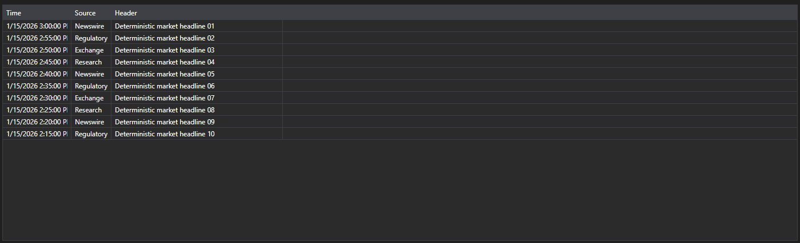
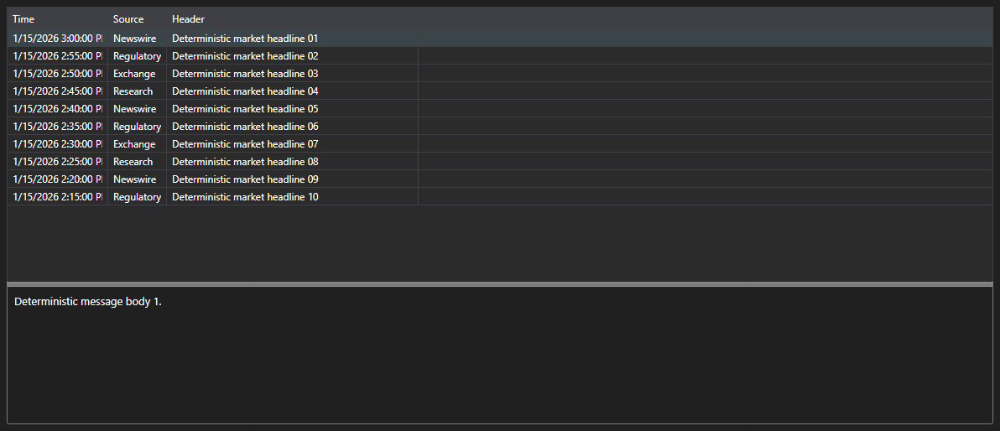

# News as messages





[NewsMessageGrid](xref:StockSharp.Xaml.NewsMessageGrid) - a news table that works with [NewsMessage](xref:StockSharp.Messages.NewsMessage) messages instead of business entities. It shows the time, source, identifier, headline and the link to the full story.

**Main properties**

- [NewsMessageGrid.Messages](xref:StockSharp.Xaml.NewsMessageGrid.Messages) - list of news messages.
- [NewsMessageGrid.SelectedMessage](xref:StockSharp.Xaml.NewsMessageGrid.SelectedMessage) - selected message.
- [NewsMessageGrid.SelectedMessages](xref:StockSharp.Xaml.NewsMessageGrid.SelectedMessages) - selected messages.
- [NewsMessageGrid.MaxCount](xref:StockSharp.Xaml.NewsMessageGrid.MaxCount) - maximum number of rows in the table; the oldest rows are removed once it is exceeded.
- [NewsMessageGrid.SubscriptionProvider](xref:StockSharp.Xaml.NewsMessageGrid.SubscriptionProvider) - subscription provider the table asks for the full news story.

The ready made pair of the table and the story text is [NewsMessagePanel](xref:StockSharp.Xaml.NewsMessagePanel). It hosts [NewsMessageGrid](xref:StockSharp.Xaml.NewsMessageGrid) and [NewsStoryPanel](xref:StockSharp.Xaml.NewsStoryPanel): when a row is selected the panel requests the story from the subscription provider and shows it at the bottom.

Below are code snippets showing its usage:

```xaml
<Window x:Class="Sample.NewsWindow"
	xmlns="http://schemas.microsoft.com/winfx/2006/xaml/presentation"
	xmlns:x="http://schemas.microsoft.com/winfx/2006/xaml"
	xmlns:xaml="http://schemas.stocksharp.com/xaml"
	Height="400" Width="900">
	<xaml:NewsMessagePanel x:Name="NewsPanel" />
</Window>
```

```cs
// Set the subscription provider - the news story is requested through it
NewsPanel.SubscriptionProvider = _connector;

// Add incoming news to the table on the user interface thread
_connector.NewsReceived += (subscription, news) =>
	this.GuiAsync(() => NewsPanel.NewsGrid.Messages.Add(news.ToMessage()));

// Create the news subscription
_connector.Subscribe(new Subscription(DataType.News));
```

## See also

[Market-data](../market_data.md)
