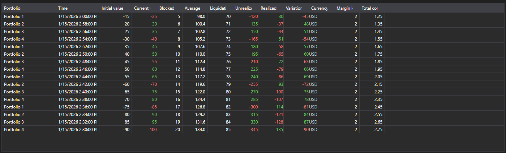

# Position changes



[PositionChangeGrid](xref:StockSharp.Xaml.PositionChangeGrid) - a table of [PositionChangeMessage](xref:StockSharp.Messages.PositionChangeMessage) messages. Unlike the portfolio table it shows not the current state but the stream of changes: every row is a separate message with the set of changed values.

**Main properties**

- [PositionChangeGrid.Messages](xref:StockSharp.Xaml.PositionChangeGrid.Messages) - list of position change messages.
- [PositionChangeGrid.SelectedMessage](xref:StockSharp.Xaml.PositionChangeGrid.SelectedMessage) - selected message.
- [PositionChangeGrid.SelectedMessages](xref:StockSharp.Xaml.PositionChangeGrid.SelectedMessages) - selected messages.
- [PositionChangeGrid.MaxCount](xref:StockSharp.Xaml.PositionChangeGrid.MaxCount) - maximum number of rows in the table; the oldest rows are removed once it is exceeded.

Such a stream is handy when investigating discrepancies: you see which value the connector sent and when, not only the final result.

Below are code snippets showing its usage:

```xaml
<Window x:Class="Sample.PositionChangesWindow"
	xmlns="http://schemas.microsoft.com/winfx/2006/xaml/presentation"
	xmlns:x="http://schemas.microsoft.com/winfx/2006/xaml"
	xmlns:xaml="http://schemas.stocksharp.com/xaml"
	Height="400" Width="900">
	<xaml:PositionChangeGrid x:Name="PositionChangeGrid" />
</Window>
```

```cs
// Receive position changes from the connector
_connector.PositionReceived += (subscription, position) =>
{
	var message = position.ToChangeMessage();

	// Add the message to the table on the user interface thread
	this.GuiAsync(() => PositionChangeGrid.Messages.Add(message));
};

// Create the position changes subscription
_connector.Subscribe(new Subscription(DataType.PositionChanges));
```

## See also

[Portfolios](../portfolios.md)
