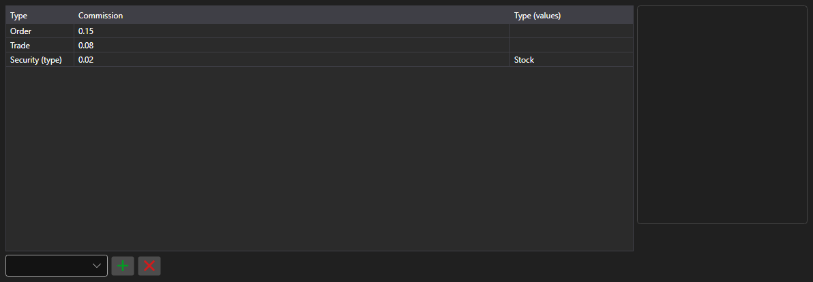

# Commission rules



[CommissionPanel](xref:StockSharp.Xaml.CommissionPanel) - a table of commission rules. Every row is an [ICommissionRule](xref:StockSharp.Algo.Commissions.ICommissionRule) rule: per trade, per volume, per turnover, a percentage of the amount.

**Main properties**

- [CommissionPanel.Rules](xref:StockSharp.Xaml.CommissionPanel.Rules) - list of commission rules.

The rules from this table are passed to the commission manager, so a backtest counts the costs the same way real trading does.

Below are code snippets showing its usage:

```xaml
<Window x:Class="Sample.CommissionWindow"
	xmlns="http://schemas.microsoft.com/winfx/2006/xaml/presentation"
	xmlns:x="http://schemas.microsoft.com/winfx/2006/xaml"
	xmlns:xaml="http://schemas.stocksharp.com/xaml"
	Height="300" Width="700">
	<xaml:CommissionPanel x:Name="CommissionPanel" />
</Window>
```

```cs
// Commission per trade
CommissionPanel.Rules.Add(new CommissionPerTradeRule { Value = 1.5m });

// Commission per order volume
CommissionPanel.Rules.Add(new CommissionPerOrderVolumeRule { Value = 0.01m });

// Apply the rules to the commission manager
_connector.CommissionManager.Rules.Clear();
_connector.CommissionManager.Rules.AddRange(CommissionPanel.Rules);
```

## See also

[Service panels](../service_panels.md)
