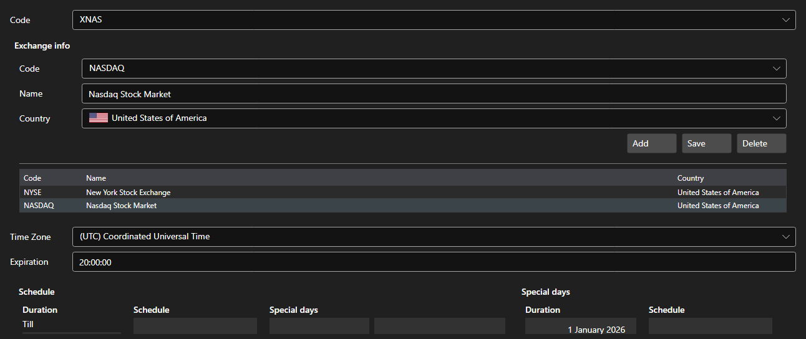

# Boards



[ExchangeBoardsPanel](xref:StockSharp.Xaml.ExchangeBoardsPanel) - a reference of [ExchangeBoard](xref:StockSharp.BusinessEntities.ExchangeBoard) trading boards. Every board has a code, an exchange, a time zone and a working schedule.

**Main properties**

- [ExchangeBoardsPanel.Boards](xref:StockSharp.Xaml.ExchangeBoardsPanel.Boards) - list of boards.
- [ExchangeBoardsPanel.SelectedBoardCode](xref:StockSharp.Xaml.ExchangeBoardsPanel.SelectedBoardCode) - code of the selected board.

The schedule is edited by the embedded [WorkingTimeControl](xref:StockSharp.Xaml.WorkingTimeControl). It is this schedule that tells a backtest when the board is open and when it is closed.

Below are code snippets showing its usage:

```xaml
<Window x:Class="Sample.BoardsWindow"
	xmlns="http://schemas.microsoft.com/winfx/2006/xaml/presentation"
	xmlns:x="http://schemas.microsoft.com/winfx/2006/xaml"
	xmlns:xaml="http://schemas.stocksharp.com/xaml"
	Height="500" Width="800">
	<xaml:ExchangeBoardsPanel x:Name="BoardsPanel" />
</Window>
```

```cs
// Select the board
BoardsPanel.SetBoardCode(ExchangeBoard.MicexTqbr.Code);

// Mark the reference as changed
BoardsPanel.Changed += () => _isModified = true;

// Save the boards
foreach (var board in BoardsPanel.Boards)
	_exchangeInfoProvider.Save(board);
```

## See also

[Service panels](../service_panels.md)
