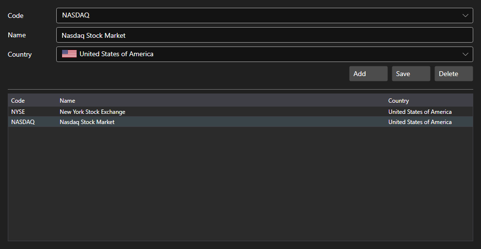

# Exchanges



[ExchangesPanel](xref:StockSharp.Xaml.ExchangesPanel) - an exchange reference. It shows the list of [Exchange](xref:StockSharp.BusinessEntities.Exchange) items with the name and the country and allows adding your own exchanges.

**Main properties**

- [ExchangesPanel.Exchanges](xref:StockSharp.Xaml.ExchangesPanel.Exchanges) - list of [Exchange](xref:StockSharp.BusinessEntities.Exchange) items.
- [ExchangesPanel.SelectedExchangeName](xref:StockSharp.Xaml.ExchangesPanel.SelectedExchangeName) - name of the selected exchange.

The panel usually goes together with [ExchangeBoardsPanel](xref:StockSharp.Xaml.ExchangeBoardsPanel): the exchange selected here defines which boards are shown there. The `SelectedExchangeChanged` event reports the change of selection.

Below are code snippets showing its usage:

```xaml
<Window x:Class="Sample.ExchangesWindow"
	xmlns="http://schemas.microsoft.com/winfx/2006/xaml/presentation"
	xmlns:x="http://schemas.microsoft.com/winfx/2006/xaml"
	xmlns:xaml="http://schemas.stocksharp.com/xaml"
	Height="400" Width="600">
	<xaml:ExchangesPanel x:Name="ExchangesPanel" />
</Window>
```

```cs
// Select the exchange
ExchangesPanel.SetExchange(Exchange.Moex.Name);

// Reset the board selection when the exchange changes
ExchangesPanel.SelectedExchangeChanged += () =>
	BoardsPanel.SetBoardCode(null);

// Save the reference
foreach (var exchange in ExchangesPanel.Exchanges)
	_exchangeInfoProvider.Save(exchange);
```

## See also

[Service panels](../service_panels.md)
