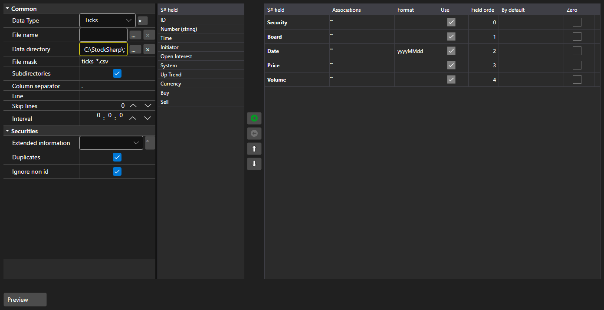

# Import settings



[ImportSettingsPanel](xref:StockSharp.Xaml.ImportSettingsPanel) - a panel that configures the data import from a text file. It defines the separator, the date and time format, the encoding and, most importantly, the set and the order of the columns.

**Main properties**

- [ImportSettingsPanel.Settings](xref:StockSharp.Xaml.ImportSettingsPanel.Settings) - import settings.
- [ImportSettingsPanel.SelectedFields](xref:StockSharp.Xaml.ImportSettingsPanel.SelectedFields) - selected fields in the order they follow in the file.
- [ImportSettingsPanel.UnSelectedFields](xref:StockSharp.Xaml.ImportSettingsPanel.UnSelectedFields) - fields that are not present in the file.

Fields are moved between the two lists and up and down until their order matches the order of the columns in the file. The [ImportSettingsPanel.HasErrors](xref:StockSharp.Xaml.ImportSettingsPanel.HasErrors) method validates the settings before the import starts.

Below are code snippets showing its usage:

```xaml
<Window x:Class="Sample.ImportWindow"
	xmlns="http://schemas.microsoft.com/winfx/2006/xaml/presentation"
	xmlns:x="http://schemas.microsoft.com/winfx/2006/xaml"
	xmlns:xaml="http://schemas.stocksharp.com/xaml"
	Height="600" Width="900">
	<xaml:ImportSettingsPanel x:Name="ImportPanel" />
</Window>
```

```cs
// Configure the tick data import
ImportPanel.Settings = new ImportSettings(DataType.Ticks, fields);

// Do not start the import with invalid settings
if (ImportPanel.HasErrors())
	return;

// Create the parser from the configured fields
var parser = new CsvParser(ImportPanel.Settings.DataType, ImportPanel.SelectedFields);
```

## See also

[Service panels](../service_panels.md)
