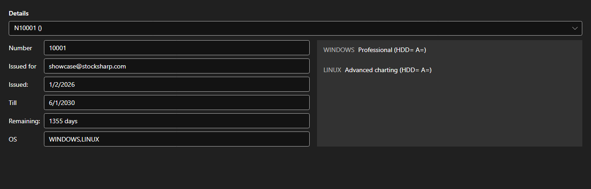

# Licenses



[LicensePanel](xref:StockSharp.Xaml.LicensePanel) - a panel of installed licenses. The license is picked in the list at the top; below it are its number, who it was issued to, the issue and expiry dates, how many days are left and the supported operating systems, and on the right \- the features it allows.

**Main properties**

- [LicensePanel.Licenses](xref:StockSharp.Xaml.LicensePanel.Licenses) - list of licenses.

The panel is embedded into the about window and into the first start wizard: it shows at once which license is expiring and which features are missing.

Below are code snippets showing its usage:

```xaml
<Window x:Class="Sample.LicenseWindow"
	xmlns="http://schemas.microsoft.com/winfx/2006/xaml/presentation"
	xmlns:x="http://schemas.microsoft.com/winfx/2006/xaml"
	xmlns:xaml="http://schemas.stocksharp.com/xaml"
	Height="400" Width="800">
	<xaml:LicensePanel x:Name="LicensePanel" />
</Window>
```

```cs
// Show the installed licenses
LicensePanel.Licenses = LicenseHelper.Licenses;
```

## See also

[Service panels](../service_panels.md)
