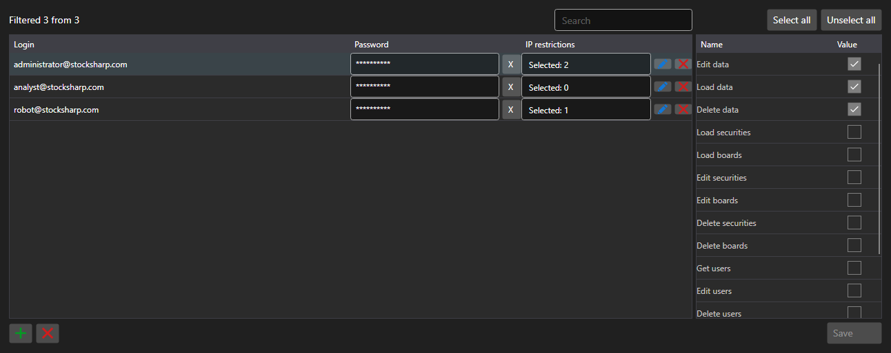

# Accounts and permissions



[PermissionCredentialsPanel](xref:StockSharp.Xaml.PermissionCredentialsPanel) - a table of server accounts with access permissions. For every entry it marks which operations are allowed: data download, editing, order registration, server management.

**Main properties**

- [PermissionCredentialsPanel.Credentials](xref:StockSharp.Xaml.PermissionCredentialsPanel.Credentials) - list of accounts.
- [PermissionCredentialsPanel.ChangedCredentials](xref:StockSharp.Xaml.PermissionCredentialsPanel.ChangedCredentials) - entries changed since the last save.
- [PermissionCredentialsPanel.SaveText](xref:StockSharp.Xaml.PermissionCredentialsPanel.SaveText) - caption of the save button.

The panel does not save the entries \- on the button it raises the `Saving` event, the application writes the changed accounts and calls [PermissionCredentialsPanel.MarkSaved](xref:StockSharp.Xaml.PermissionCredentialsPanel.MarkSaved), after which the changed list is cleared.

Below are code snippets showing its usage:

```xaml
<Window x:Class="Sample.CredentialsWindow"
	xmlns="http://schemas.microsoft.com/winfx/2006/xaml/presentation"
	xmlns:x="http://schemas.microsoft.com/winfx/2006/xaml"
	xmlns:xaml="http://schemas.stocksharp.com/xaml"
	Height="500" Width="900">
	<xaml:PermissionCredentialsPanel x:Name="CredentialsPanel" />
</Window>
```

```cs
// Show the server accounts
CredentialsPanel.Credentials.AddRange(_server.Credentials);

// Save only the changed entries
CredentialsPanel.Saving += () =>
{
	foreach (var credentials in CredentialsPanel.ChangedCredentials)
		_server.Save(credentials);

	// Clear the list of changes
	CredentialsPanel.MarkSaved();
};
```

## See also

[Service panels](../service_panels.md)
