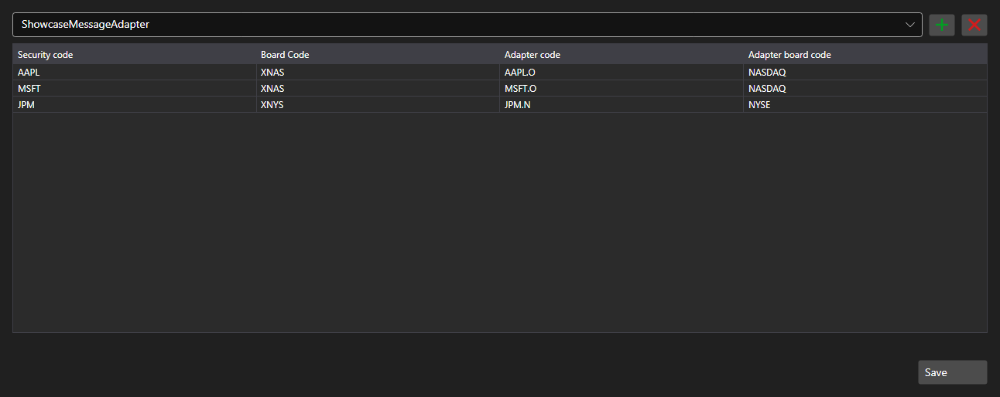

# Security code mapping



[SecurityMappingPanel](xref:StockSharp.Xaml.SecurityMappingPanel) - a table of correspondences between the security code in the system and its code at a particular connector. It solves the usual problem: the same contract is named differently by different data providers.

**Main properties**

- [SecurityMappingPanel.ConnectorsInfo](xref:StockSharp.Xaml.SecurityMappingPanel.ConnectorsInfo) - list of connectors the mappings are defined for.
- [SecurityMappingPanel.Storage](xref:StockSharp.Xaml.SecurityMappingPanel.Storage) - mapping storage.
- [SecurityMappingPanel.SaveText](xref:StockSharp.Xaml.SecurityMappingPanel.SaveText) - caption of the save button.

Rows are added and removed right in the table and pressing the save button raises the `Saving` event \- the application writes the changes into the storage and changes the button caption.

Below are code snippets showing its usage:

```xaml
<Window x:Class="Sample.MappingWindow"
	xmlns="http://schemas.microsoft.com/winfx/2006/xaml/presentation"
	xmlns:x="http://schemas.microsoft.com/winfx/2006/xaml"
	xmlns:xaml="http://schemas.stocksharp.com/xaml"
	Height="500" Width="900">
	<xaml:SecurityMappingPanel x:Name="MappingPanel" />
</Window>
```

```cs
// Set the mapping storage
MappingPanel.Storage = _securityMappingStorage;

// Add a connector to the list
MappingPanel.ConnectorsInfo.Add(new ConnectorInfo("Binance"));

// Confirm the save with the button caption
MappingPanel.Saving += () => MappingPanel.SaveText = LocalizedStrings.Saved;
```

## See also

[Service panels](../service_panels.md)
