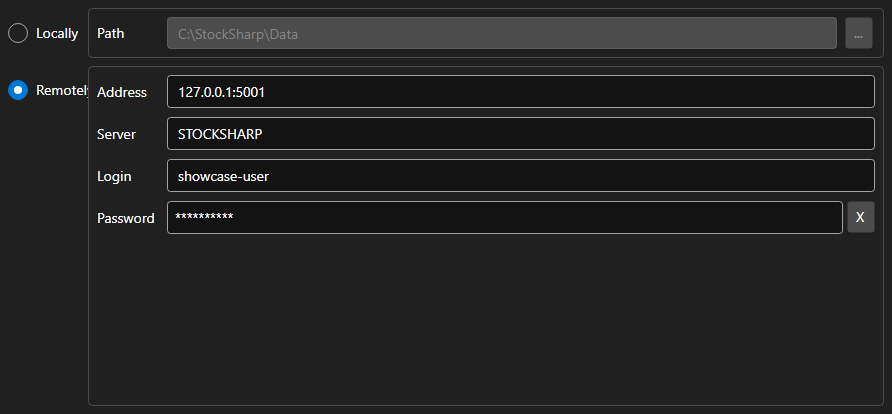

# Storage settings



[StorageSettingsPanel](xref:StockSharp.Xaml.StorageSettingsPanel) - a panel that selects the market data storage. It switches between a local folder and a remote server and sets the parameters of the chosen option.

**Main properties**

- [StorageSettingsPanel.IsLocal](xref:StockSharp.Xaml.StorageSettingsPanel.IsLocal) - use the local storage.
- [StorageSettingsPanel.Path](xref:StockSharp.Xaml.StorageSettingsPanel.Path) - path to the local storage folder.
- [StorageSettingsPanel.Address](xref:StockSharp.Xaml.StorageSettingsPanel.Address) - address of the remote server.
- [StorageSettingsPanel.Login](xref:StockSharp.Xaml.StorageSettingsPanel.Login) - user name for the remote server.
- [StorageSettingsPanel.IsCredentialsEnabled](xref:StockSharp.Xaml.StorageSettingsPanel.IsCredentialsEnabled) - availability of the login and password fields.

Any change raises the `SettingsChanged` event, which the application uses to recreate the [IMarketDataDrive](xref:StockSharp.Algo.Storages.IMarketDataDrive).

Below are code snippets showing its usage:

```xaml
<Window x:Class="Sample.StorageWindow"
	xmlns="http://schemas.microsoft.com/winfx/2006/xaml/presentation"
	xmlns:x="http://schemas.microsoft.com/winfx/2006/xaml"
	xmlns:xaml="http://schemas.stocksharp.com/xaml"
	Height="300" Width="500">
	<xaml:StorageSettingsPanel x:Name="StoragePanel" />
</Window>
```

```cs
// Choose the local folder
StoragePanel.IsLocal = true;
StoragePanel.Path = @"C:\Data";

// Mark the settings as changed
StoragePanel.SettingsChanged += () => _isModified = true;

// Create the storage from the panel settings
var drive = StoragePanel.IsLocal
	? new LocalMarketDataDrive(StoragePanel.Path)
	: (IMarketDataDrive)new RemoteMarketDataDrive(StoragePanel.Address.To<EndPoint>());
```

## See also

[Service panels](../service_panels.md)
