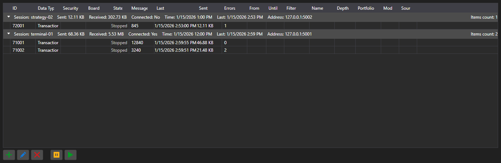

# Subscriptions



[SubscriptionPanel](xref:StockSharp.Xaml.SubscriptionPanel) - a table of active subscriptions grouped by sessions. For every subscription it shows the data type, the message count, the time of the last message, the error count and the amount of transferred data.

**Main properties**

- [SubscriptionPanel.Subscriptions](xref:StockSharp.Xaml.SubscriptionPanel.Subscriptions) - list of subscriptions.
- [SubscriptionPanel.Sessions](xref:StockSharp.Xaml.SubscriptionPanel.Sessions) - list of sessions.
- [SubscriptionPanel.SelectedSubscriptions](xref:StockSharp.Xaml.SubscriptionPanel.SelectedSubscriptions) - selected subscriptions.

The panel is used on the server side: it shows who is connected, what they request and how much data they receive. Actions on rows \- adding, editing, removing, suspending \- raise the events of the same names, and the application performs them.

Below are code snippets showing its usage:

```xaml
<Window x:Class="Sample.SubscriptionsWindow"
	xmlns="http://schemas.microsoft.com/winfx/2006/xaml/presentation"
	xmlns:x="http://schemas.microsoft.com/winfx/2006/xaml"
	xmlns:xaml="http://schemas.stocksharp.com/xaml"
	Height="400" Width="1000">
	<xaml:SubscriptionPanel x:Name="SubscriptionPanel" />
</Window>
```

```cs
// Register the client session
SubscriptionPanel.AddSession(sessionId, new SessionInfo(sessionId, DateTime.UtcNow, address));

// Add the subscription to the table
SubscriptionPanel.Subscriptions.Add(new SubscriptionInfo(session, subscription));

// Unsubscribe on the command from the table
SubscriptionPanel.SubscriptionRemoving += info => _connector.UnSubscribe(info.Subscription);
```

## See also

[Service panels](../service_panels.md)
