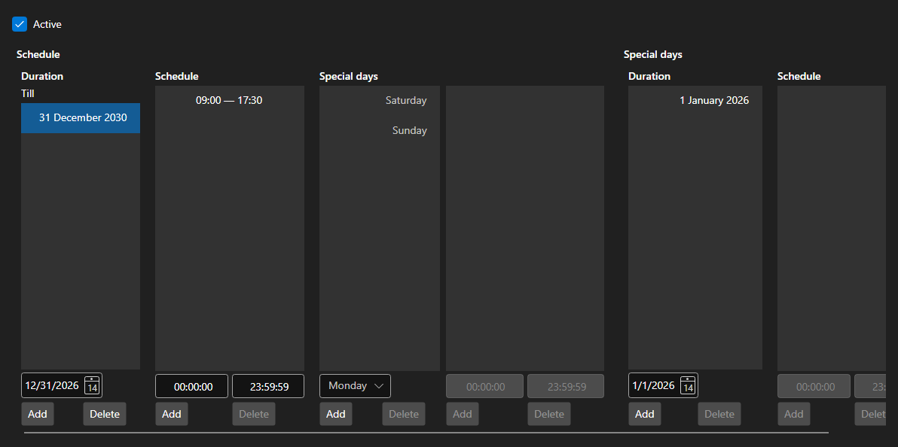

# Working schedule



[WorkingTimeControl](xref:StockSharp.Xaml.WorkingTimeControl) - an editor of the [WorkingTime](xref:StockSharp.Messages.WorkingTime) schedule. It defines the periods the schedule is valid for, the working hours per day of week and the special days \- holidays and moved days.

**Main properties**

- [WorkingTimeControl.WorkingTime](xref:StockSharp.Xaml.WorkingTimeControl.WorkingTime) - edited schedule.
- [WorkingTimeControl.ShowActive](xref:StockSharp.Xaml.WorkingTimeControl.ShowActive) - display of the currently active period.

A schedule consists of periods, each with its own set of working hours per day of week. The hours are edited as a list of ranges, and errors \- overlapping ranges, an end earlier than the start \- are reported by the `Error` event.

Below are code snippets showing its usage:

```xaml
<Window x:Class="Sample.WorkingTimeWindow"
	xmlns="http://schemas.microsoft.com/winfx/2006/xaml/presentation"
	xmlns:x="http://schemas.microsoft.com/winfx/2006/xaml"
	xmlns:xaml="http://schemas.stocksharp.com/xaml"
	Height="500" Width="700">
	<xaml:WorkingTimeControl x:Name="WorkingTimeControl" />
</Window>
```

```cs
// Show the board schedule
WorkingTimeControl.WorkingTime = ExchangeBoard.MicexTqbr.WorkingTime;

// Show the error next to the editor
WorkingTimeControl.Error += (message, isError) => ShowStatus(message, isError);

// Mark the schedule as changed
WorkingTimeControl.DataChanged += () => _isModified = true;
```

## See also

[Service panels](../service_panels.md)
