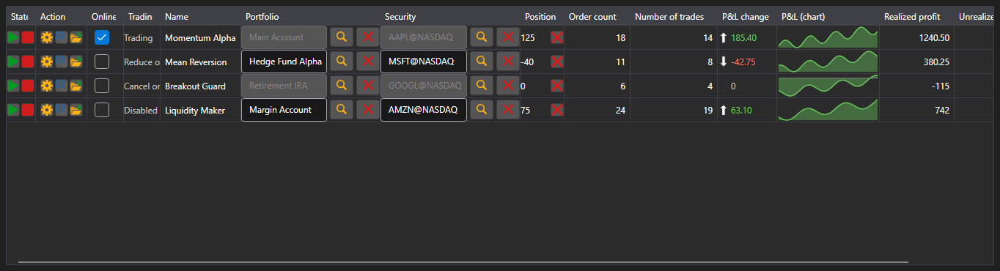

# Strategies dashboard



[StrategiesDashboard](xref:StockSharp.Xaml.StrategiesDashboard) - a table of simultaneously running strategies. One row shows the security, portfolio, state, position, profit, order and trade counts and the control buttons.

**Main properties**

- [StrategiesDashboard.Items](xref:StockSharp.Xaml.StrategiesDashboard.Items) - list of dashboard rows.
- [StrategiesDashboard.SecurityProvider](xref:StockSharp.Xaml.StrategiesDashboard.SecurityProvider) - security provider for the security column.
- [StrategiesDashboard.Portfolios](xref:StockSharp.Xaml.StrategiesDashboard.Portfolios) - portfolio source for the portfolio column.

A dashboard row is an [IStrategiesDashboardItem](xref:StockSharp.Xaml.IStrategiesDashboardItem), not the strategy itself: the start, stop, close position, settings and risk rule buttons work through the commands of that interface. That is why the dashboard suits both local strategies and the ones running on a server.

Below are code snippets showing its usage:

```xaml
<Window x:Class="Sample.DashboardWindow"
	xmlns="http://schemas.microsoft.com/winfx/2006/xaml/presentation"
	xmlns:x="http://schemas.microsoft.com/winfx/2006/xaml"
	xmlns:xaml="http://schemas.stocksharp.com/xaml"
	Height="400" Width="1100">
	<xaml:StrategiesDashboard x:Name="Dashboard" />
</Window>
```

```cs
// Set the sources for the security and portfolio columns
Dashboard.SecurityProvider = _connector;
Dashboard.Portfolios = new PortfolioDataSource(_connector);

// Add dashboard rows for your strategies
foreach (var strategy in _strategies)
	Dashboard.Items.Add(new StrategyDashboardItem(strategy));

// Remove a stopped strategy from the dashboard
Dashboard.Items.Remove(Dashboard.Items.First(i => i.ProcessState == ProcessStates.Stopped));
```

## See also

[Strategies](../strategies.md)
