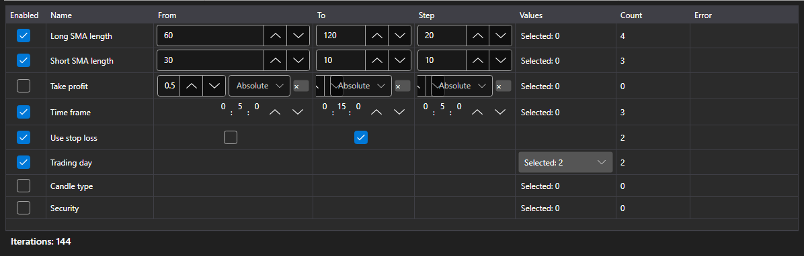

# Optimization parameters



[OptimizationParametersPanel](xref:StockSharp.Xaml.OptimizationParametersPanel) \- an editor of the parameters the sweep goes over. One row \- one strategy parameter: the check box includes it into the sweep, then come the bounds and the step or the list of values, and under the table \- the total: how many runs the current set gives.

**Main properties**

- [OptimizationParametersPanel.Parameters](xref:StockSharp.Xaml.OptimizationParametersPanel.Parameters) \- the rows of the editor. Any collection of [IOptimizationParameterRow](xref:StockSharp.Xaml.IOptimizationParameterRow) fits, so every application can have its own parameter model.
- [OptimizationParametersPanel.MaxIterations](xref:StockSharp.Xaml.OptimizationParametersPanel.MaxIterations) \- the cap on the number of runs; zero means there is no cap.
- [OptimizationParametersPanel.TotalCount](xref:StockSharp.Xaml.OptimizationParametersPanel.TotalCount) \- how many runs the current set gives: the product of the number of values of all the included parameters, cut down by the cap.
- [OptimizationParametersPanel.FirstProblem](xref:StockSharp.Xaml.OptimizationParametersPanel.FirstProblem) \- the first reason why the set cannot be started.

The set of values depends on the parameter type: for a number and for [TimeSpan](xref:System.TimeSpan) these are the bounds and the step, for [bool](xref:System.Boolean) \- two values, for an enumeration, [Security](xref:StockSharp.BusinessEntities.Security) and [DataType](xref:StockSharp.Messages.DataType) \- an explicit list. A row that cannot be gone through (the step is zero, the bounds are not set, the list is empty) explains the reason right in the table, and the total counter does not count such a row.

The number of runs grows as a product, not as a sum: three parameters of five values each \- that is 125 runs, not 15. That is why the counter stands next to the table and not on the next step of the wizard.

Below are code snippets showing its usage:

```xaml
<Window x:Class="Sample.OptimizationWindow"
	xmlns="http://schemas.microsoft.com/winfx/2006/xaml/presentation"
	xmlns:x="http://schemas.microsoft.com/winfx/2006/xaml"
	xmlns:xaml="http://schemas.stocksharp.com/xaml"
	Height="400" Width="700">
	<xaml:OptimizationParametersPanel x:Name="ParametersPanel" />
</Window>
```

```cs
// The editor rows are the application model implementing IOptimizationParameterRow
ParametersPanel.Parameters = _rows;

// The cap on the number of runs
ParametersPanel.MaxIterations = 5000;

// Starting is allowed when the set is not empty and has no errors
StartButton.IsEnabled = ParametersPanel.TotalCount > 0 && ParametersPanel.FirstProblem.Length == 0;
```

## See also

[Strategies](../strategies.md)

[Optimization results](optimization_results.md)
