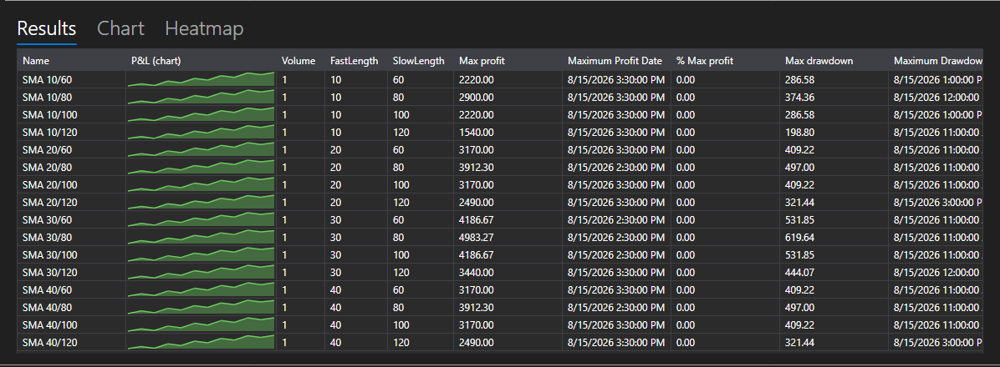

# Optimization results



[OptimizationResultsPanel](xref:StockSharp.Xaml.Charting.OptimizationResultsPanel) \- three ways to read the results of a sweep, collected in one control:

- **Results** \- a table of runs: the parameter values, the statistics and the P&L chart of every run next to its numbers. This is [StrategiesStatisticsPanel](xref:StockSharp.Xaml.StrategiesStatisticsPanel), so the columns are sorted and configured the same way as everywhere else.
- **Chart** \- a three-dimensional surface over two parameters: the axes are chosen in the lists above the chart, the height \- the selected statistics parameter.
- **Heatmap** \- the same surface from above. The axes are set once, on the chart, and the map repeats them.

**Main properties**

- [OptimizationResultsPanel.ViewModel](xref:StockSharp.Xaml.Charting.OptimizationResultsPanel.ViewModel) \- the results from which all three surfaces are drawn.

Runs are added to [OptimizationResultsViewModel](xref:StockSharp.Xaml.Charting.OptimizationResultsViewModel) at the moment they start, not when they finish: the row appears in the table at once and then follows its strategy, so a running run is visible on all three surfaces.

- [OptimizationResultsViewModel.AddRun](xref:StockSharp.Xaml.Charting.OptimizationResultsViewModel.AddRun(StockSharp.Algo.Strategies.Strategy,System.Collections.Generic.IEnumerable{StockSharp.Algo.Strategies.IStrategyParam})) \- adds a run. The first run defines the columns of the table and what the axes offer.
- [OptimizationResultsViewModel.Refresh](xref:StockSharp.Xaml.Charting.OptimizationResultsViewModel.Refresh) \- redraws the surfaces when the measured values have changed.
- [OptimizationResultsViewModel.Clear](xref:StockSharp.Xaml.Charting.OptimizationResultsViewModel.Clear) \- resets the runs before a new sweep.

One combination of parameters \- one point of the surface. If a combination was run several times, the point shows the average; if a combination was not run at all, the heatmap fills it with the lowest value, so that a gap does not look like a peak.

Below are code snippets showing its usage:

```xaml
<Window x:Class="Sample.OptimizationResultsWindow"
	xmlns="http://schemas.microsoft.com/winfx/2006/xaml/presentation"
	xmlns:x="http://schemas.microsoft.com/winfx/2006/xaml"
	xmlns:charting="http://schemas.stocksharp.com/xaml"
	Height="600" Width="900">
	<charting:OptimizationResultsPanel x:Name="ResultsPanel" />
</Window>
```

```cs
_results = new OptimizationResultsViewModel();
ResultsPanel.ViewModel = _results;

// The optimizer reports a run at the moment it starts
_optimizer.StrategyInitialized += (strategy, parameters) =>
	this.GuiAsync(() => _results.AddRun(strategy, parameters));
```

## See also

[Strategies](../strategies.md)

[Optimization parameters](optimization_parameters.md)
