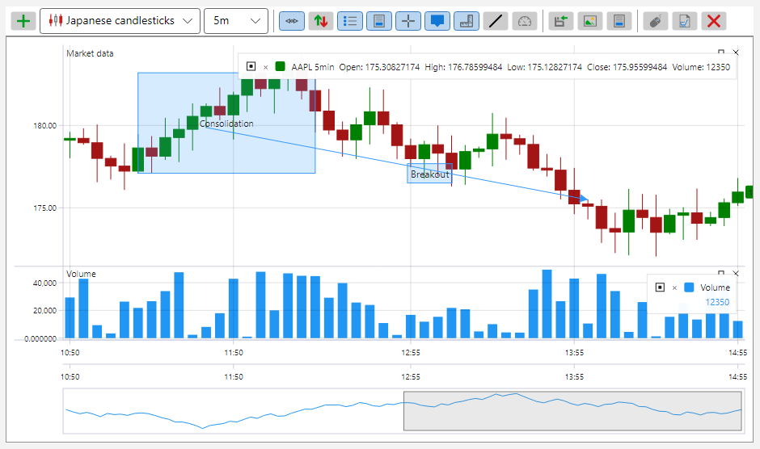
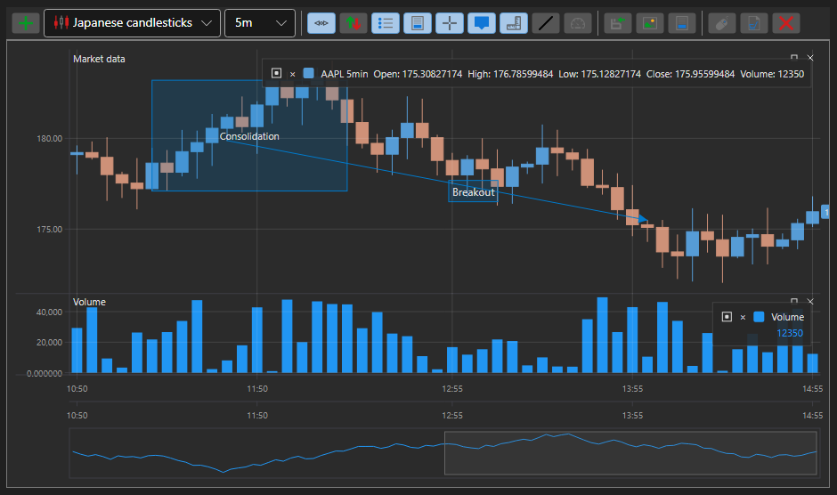

# Themes of S# graphic components

All S# graphic components come in two themes \- the light one and the dark one. The theme is set once, at the application level, and all the components pick it up at once: the colors are taken from resources rather than written into every control.

The light theme:



The dark theme:



One line is enough to set the theme:

```cs
...
ThemeExtensions.ApplyDefaultTheme();
...
```

**Main methods of [ThemeExtensions](xref:StockSharp.Xaml.ThemeExtensions)**

- [ThemeExtensions.ApplyDefaultTheme](xref:StockSharp.Xaml.ThemeExtensions.ApplyDefaultTheme(System.Boolean)) \- applies the dark or the light theme.
- [ThemeExtensions.Invert](xref:StockSharp.Xaml.ThemeExtensions.Invert) \- switches the theme to the opposite one.
- [ThemeExtensions.IsCurrDark](xref:StockSharp.Xaml.ThemeExtensions.IsCurrDark) \- whether the current theme is dark or not.

Changing the theme takes effect immediately: the application does not need to be restarted, all the open panels and charts are redrawn in the new colors.

The colors specific to the trading components \- rise and fall, buy and sell, order book levels, the grid lines of the tables \- live in a separate set of resources and change together with the theme. That is why your own control that takes its colors from that set instead of setting them itself will look equally at home in both themes.
