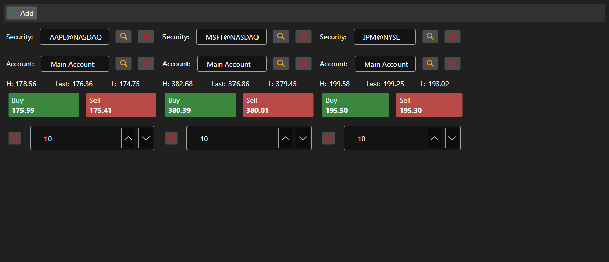

# Buy\/Sell panel set



[BuySellGrid](xref:StockSharp.Xaml.BuySellGrid) - a container of several [BuySellPanel](xref:StockSharp.Xaml.BuySellPanel) panels \- one per security. It allows trading several securities from a single screen.

**Main properties**

- [BuySellGrid.SecurityProvider](xref:StockSharp.Xaml.BuySellGrid.SecurityProvider) - security provider used for selection in the panels.
- [BuySellGrid.Portfolios](xref:StockSharp.Xaml.BuySellGrid.Portfolios) - portfolio source.
- [BuySellGrid.MarketDataProvider](xref:StockSharp.Xaml.BuySellGrid.MarketDataProvider) - market data provider the panels take best prices from.
- [BuySellGrid.Panels](xref:StockSharp.Xaml.BuySellGrid.Panels) - current set of panels.

Panels are added by [BuySellGrid.AddPanel](xref:StockSharp.Xaml.BuySellGrid.AddPanel(StockSharp.BusinessEntities.Security)) and removed by [BuySellGrid.RemovePanel](xref:StockSharp.Xaml.BuySellGrid.RemovePanel(StockSharp.Xaml.BuySellPanel)). The container does not register orders \- it raises `OrderRegistering` with the security, portfolio, side, price and volume. The set of panels is persisted and restored by `Save` and `Load`.

Below are code snippets showing its usage:

```xaml
<Window x:Class="Sample.BuySellWindow"
	xmlns="http://schemas.microsoft.com/winfx/2006/xaml/presentation"
	xmlns:x="http://schemas.microsoft.com/winfx/2006/xaml"
	xmlns:xaml="http://schemas.stocksharp.com/xaml"
	Height="400" Width="900">
	<xaml:BuySellGrid x:Name="BuySellGrid" />
</Window>
```

```cs
// Set the data sources for all panels
BuySellGrid.SecurityProvider = _connector;
BuySellGrid.MarketDataProvider = _connector;
BuySellGrid.Portfolios = new PortfolioDataSource(_connector);

// Add a panel for the security
BuySellGrid.AddPanel(_security);

// Register the order built by the panel
BuySellGrid.OrderRegistering += (security, portfolio, side, price, volume) =>
{
	_connector.RegisterOrder(new Order
	{
		Security = security,
		Portfolio = portfolio,
		Side = side,
		Price = price,
		Volume = volume,
	});
};
```

## See also

[Trading](../trading.md)
