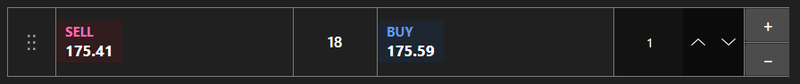

# Quick order panel



[QuickOrderPanel](xref:StockSharp.Xaml.QuickOrderPanel) - a compact one click order panel. It shows the best bid and ask, the spread and the order volume; clicking a side immediately builds an order.

**Main properties**

- [QuickOrderPanel.Security](xref:StockSharp.Xaml.QuickOrderPanel.Security) - security the orders are registered for.
- [QuickOrderPanel.Volume](xref:StockSharp.Xaml.QuickOrderPanel.Volume) - order volume.
- [QuickOrderPanel.BuyBackground](xref:StockSharp.Xaml.QuickOrderPanel.BuyBackground) - background of the buy side.
- [QuickOrderPanel.SellBackground](xref:StockSharp.Xaml.QuickOrderPanel.SellBackground) - background of the sell side.

The panel does not register orders itself \- it only builds an [Order](xref:StockSharp.BusinessEntities.Order) object and passes it to the `RegisterOrder` event. The portfolio and any extra checks are added in the handler. Changing the volume or the appearance raises `SettingsChanged`, which is a convenient place to persist settings.

Below are code snippets showing its usage:

```xaml
<Window x:Class="Sample.QuickOrderWindow"
	xmlns="http://schemas.microsoft.com/winfx/2006/xaml/presentation"
	xmlns:x="http://schemas.microsoft.com/winfx/2006/xaml"
	xmlns:xaml="http://schemas.stocksharp.com/xaml"
	Height="300" Width="260">
	<xaml:QuickOrderPanel x:Name="QuickOrderPanel" Volume="10" />
</Window>
```

```cs
// Set the security - the panel subscribes to its best prices
QuickOrderPanel.Security = _security;

// The panel builds the order, we register it ourselves
QuickOrderPanel.RegisterOrder += order =>
{
	order.Portfolio = _portfolio;
	_connector.RegisterOrder(order);
};

// Persist the settings when they change
QuickOrderPanel.SettingsChanged += () => SaveSettings();
```

## See also

[Trading](../trading.md)
