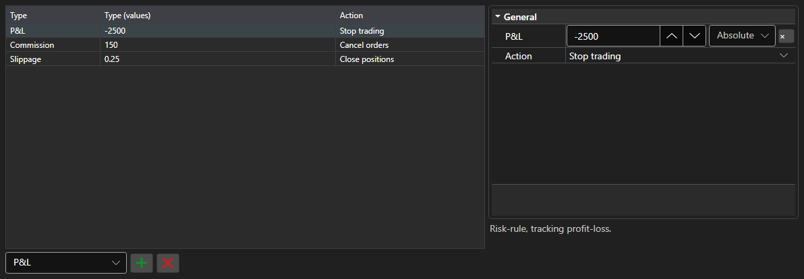

# Risk management rules



[RiskPanel](xref:StockSharp.Xaml.RiskPanel) - a table of risk management rules. It allows adding, removing and editing [IRiskRule](xref:StockSharp.Algo.Risk.IRiskRule) rules: every rule has a trigger condition and an action.

**Main properties**

- [RiskPanel.Rules](xref:StockSharp.Xaml.RiskPanel.Rules) - list of rules; the same list used by [IRiskManager](xref:StockSharp.Algo.Risk.IRiskManager).

On the left is the rule list: type, condition value and the action on trigger. On the right are the properties of the selected rule, different for every type. A new rule is added by picking its type in the list under the table, an unwanted one is removed by the button next to it. The column layout and widths are persisted by `Save` and `Load`.

Below are code snippets showing its usage:

```xaml
<Window x:Class="Sample.RiskWindow"
	xmlns="http://schemas.microsoft.com/winfx/2006/xaml/presentation"
	xmlns:x="http://schemas.microsoft.com/winfx/2006/xaml"
	xmlns:xaml="http://schemas.stocksharp.com/xaml"
	Height="400" Width="700">
	<xaml:RiskPanel x:Name="RiskPanel" />
</Window>
```

```cs
// Show the rules of the current risk manager
RiskPanel.Rules.AddRange(_connector.RiskManager.Rules);

// Add a rule: stop trading on a loss
RiskPanel.Rules.Add(new RiskPnLRule
{
	PnL = -1000,
	Action = RiskActions.StopTrading,
});

// Return the edited rules to the risk manager
_connector.RiskManager.Rules.Clear();
_connector.RiskManager.Rules.AddRange(RiskPanel.Rules);
```

## See also

[Trading](../trading.md)
