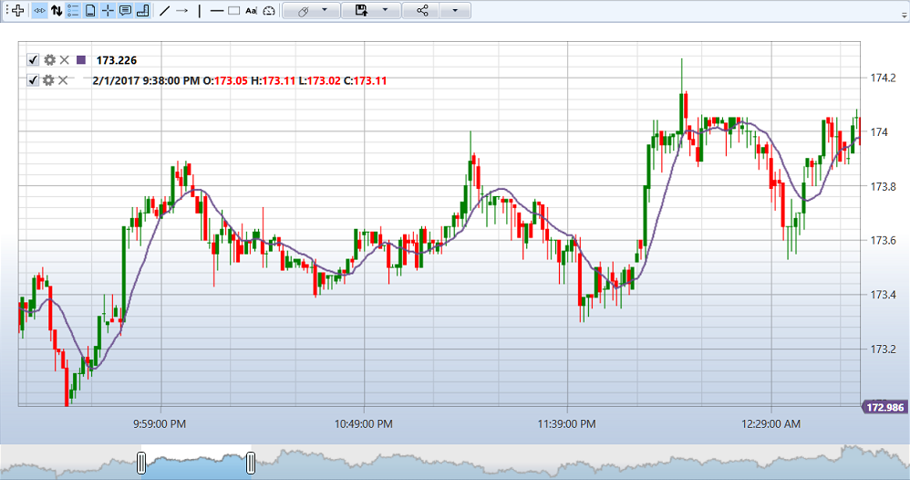

# Adding an Indicator to the Chart

The following example demonstrates how to add an indicator for drawing on a chart:

```cs
private readonly Connector _connector = new Connector();
private Security _security;
private Subscription _candleSubscription;
private SimpleMovingAverage _sma;
readonly TimeSpan _timeFrame = TimeSpan.FromMinutes(1);
private ChartArea _area;
private ChartCandleElement _candlesElem;
private ChartIndicatorElement _longMaElem;

// Initializing chart and indicator
private void InitializeChart()
{
    // _chart - StockSharp.Xaml.Charting.Chart
    // Creating a chart area
    _area = new ChartArea();
    _chart.Areas.Add(_area);
    
    // Creating a chart element representing candles
    _candlesElem = new ChartCandleElement();
    _area.Elements.Add(_candlesElem);
    
    // Creating a chart element representing the indicator
    _longMaElem = new ChartIndicatorElement
    {
        Title = "Long"
    };
    _area.Elements.Add(_longMaElem);
    
    // Creating an indicator
    _sma = new SimpleMovingAverage() { Length = 80 };
    
    // Subscribing to the candle receiving event
    _connector.CandleReceived += OnCandleReceived;
}

// Method for subscribing to candles
private void SubscribeToCandles()
{
    // Creating a subscription to candles with the specified timeframe
    _candleSubscription = new Subscription(
        DataType.TimeFrame(_timeFrame),
        _security)
    {
        MarketData = 
        {
            // Requesting historical data for 30 days
            From = DateTime.Today.Subtract(TimeSpan.FromDays(30)),
            To = DateTime.Now,
            // Receiving only finished candles
            IsFinishedOnly = true
        }
    };
    
    // Starting the subscription
    _connector.Subscribe(_candleSubscription);
}

// Handler for the candle receiving event
private void OnCandleReceived(Subscription subscription, ICandleMessage candle)
{
    // Checking if the candle belongs to our subscription
    if (subscription != _candleSubscription)
        return;
    
    // Checking the candle state
    if (candle.State != CandleStates.Finished)
        return;
    
    // Processing the candle with the indicator
    var longValue = _sma.Process(candle);
    
    // Creating data for drawing
    var data = new ChartDrawData();
    data
        .Group(candle.OpenTime)
            .Add(_candlesElem, candle)
            .Add(_longMaElem, longValue);
    
    // Drawing on the chart in the UI thread
    this.GuiAsync(() => _chart.Draw(data));
}

// Method for unsubscribing when closing the window
private void UnsubscribeFromCandles()
{
    if (_candleSubscription != null)
    {
        _connector.CandleReceived -= OnCandleReceived;
        _connector.UnSubscribe(_candleSubscription);
        _candleSubscription = null;
    }
}
```



## Example of working with multiple indicators

```cs
private readonly Connector _connector = new Connector();
private Security _security;
private Subscription _candleSubscription;
private SimpleMovingAverage _shortSma;
private SimpleMovingAverage _longSma;
private ChartArea _mainArea;
private ChartArea _indicatorArea;
private ChartCandleElement _candlesElem;
private ChartIndicatorElement _shortSmaElem;
private ChartIndicatorElement _longSmaElem;
private RelativeStrengthIndex _rsi;
private ChartIndicatorElement _rsiElem;

// Initializing chart and indicators
private void InitializeChartWithMultipleIndicators()
{
    // Creating the main area for candles and moving averages
    _mainArea = new ChartArea();
    _chart.Areas.Add(_mainArea);
    
    // Creating an area for RSI
    _indicatorArea = new ChartArea();
    _chart.Areas.Add(_indicatorArea);
    
    // Creating chart elements
    _candlesElem = new ChartCandleElement();
    _shortSmaElem = new ChartIndicatorElement { Title = "SMA (short)" };
    _longSmaElem = new ChartIndicatorElement { Title = "SMA (long)" };
    _rsiElem = new ChartIndicatorElement { Title = "RSI" };
    
    // Setting element colors
    _shortSmaElem.Color = Colors.Red;
    _longSmaElem.Color = Colors.Blue;
    _rsiElem.Color = Colors.Green;
    
    // Adding elements to their respective areas
    _mainArea.Elements.Add(_candlesElem);
    _mainArea.Elements.Add(_shortSmaElem);
    _mainArea.Elements.Add(_longSmaElem);
    _indicatorArea.Elements.Add(_rsiElem);
    
    // Creating indicators
    _shortSma = new SimpleMovingAverage { Length = 9 };
    _longSma = new SimpleMovingAverage { Length = 20 };
    _rsi = new RelativeStrengthIndex { Length = 14 };
    
    // Subscribing to the candle receiving event
    _connector.CandleReceived += OnCandleReceivedMultipleIndicators;
    
    // Creating a subscription to candles
    _candleSubscription = new Subscription(
        DataType.TimeFrame(TimeSpan.FromMinutes(5)),
        _security)
    {
        MarketData = 
        {
            From = DateTime.Today.Subtract(TimeSpan.FromDays(30)),
            To = DateTime.Now,
            IsFinishedOnly = true
        }
    };
    
    // Starting the subscription
    _connector.Subscribe(_candleSubscription);
}

// Handler for the candle receiving event for multiple indicators
private void OnCandleReceivedMultipleIndicators(Subscription subscription, ICandleMessage candle)
{
    // Checking if the candle belongs to our subscription
    if (subscription != _candleSubscription)
        return;
    
    if (candle.State != CandleStates.Finished)
        return;
    
    // Processing the candle with indicators
    var shortSmaValue = _shortSma.Process(candle);
    var longSmaValue = _longSma.Process(candle);
    var rsiValue = _rsi.Process(candle);
    
    // Creating data for drawing
    var data = new ChartDrawData();
    data
        .Group(candle.OpenTime)
            .Add(_candlesElem, candle)
            .Add(_shortSmaElem, shortSmaValue)
            .Add(_longSmaElem, longSmaValue)
            .Add(_rsiElem, rsiValue);
    
    // Drawing on the chart in the UI thread
    this.GuiAsync(() => _chart.Draw(data));
}
```

## See also

[Components for building charts](../graphical_user_interface/charts.md)