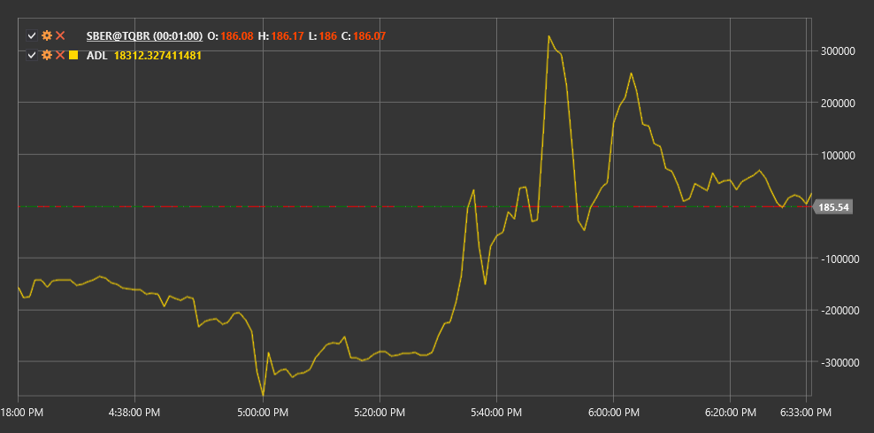

# ADL

**Accumulation/Distribution Line (ADL)** is a volume indicator developed by Mark Chaikin. The indicator evaluates the supply and demand relationship in the market by analyzing the correlation between price and volume.

To use the indicator, you need to use the [AccumulationDistributionLine](xref:StockSharp.Algo.Indicators.AccumulationDistributionLine) class.

## Description

The Accumulation/Distribution Line is a cumulative indicator that uses volume and price to determine whether a security is in an accumulation (buying) or distribution (selling) phase.

The ADL indicator helps confirm a trend or warn about its potential reversal:
- If the price is rising and ADL is falling, this may signal weakness in an upward trend.
- If the price is falling and ADL is rising, this may indicate a potential reversal of a downward trend.

## Calculation

The Accumulation/Distribution Line calculation occurs in two steps:

**1. Volume Multiplier (CLV - Close Location Value) Calculation:**
```
CLV = ((Close - Low) - (High - Close)) / (High - Low)
```

**2. ADL Calculation:**
```
ADL = Previous ADL Value + CLV * Volume
```

Where:
- Close - closing price of the period
- Low - minimum price of the period
- High - maximum price of the period
- Volume - trading volume for the period

If (High - Low) is equal to zero, CLV is set to zero.



## See Also

[OBV](on_balance_volume.md)