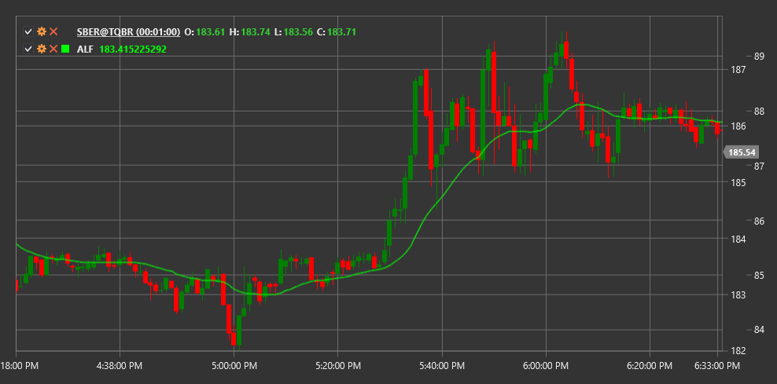

# ALF

**Adaptive Laguerre Filter (ALF)** is an indicator developed to smooth price data with minimal lag, based on the mathematical principles of the Laguerre filter.

To use the indicator, you need to use the [AdaptiveLaguerreFilter](xref:StockSharp.Algo.Indicators.AdaptiveLaguerreFilter) class.

## Description

The Adaptive Laguerre Filter is an advanced market noise filtering tool. It provides a smoother representation of price movement while maintaining a quick response to real trend changes. This filter is particularly useful for reducing the lag often encountered in traditional smoothing indicators.

The main advantage of ALF over classical moving averages lies in its ability to more effectively separate market noise from genuine price movements, making it a valuable tool for traders seeking to reduce false signals.

## Parameters

The indicator has the following parameters:
- **Gamma** - filtering coefficient (typically in the range of 0.1 to 0.9)

The Gamma parameter determines the degree of smoothing: lower values create a smoother line with more lag, while higher values result in less smoothing but a faster response to price changes.

## Calculation

The Adaptive Laguerre Filter is based on Laguerre polynomials and represents a finite impulse response (FIR) filtering system. The calculation uses the following formulas:

1. Intermediate values L0, L1, L2, and L3 are calculated:
   ```
   L0(t) = (1 - γ) * price(t) + γ * L0(t-1)
   L1(t) = -γ * L0(t) + L0(t-1) + γ * L1(t-1)
   L2(t) = -γ * L1(t) + L1(t-1) + γ * L2(t-1)
   L3(t) = -γ * L2(t) + L2(t-1) + γ * L3(t-1)
   ```

2. The final ALF value is calculated as the average:
   ```
   ALF = (L0 + L1 + L2 + L3) / 4
   ```

Where:
- γ (gamma) - filtering coefficient
- price(t) - current price
- L0, L1, L2, L3 - intermediate filter values



## See Also

[LaguerreRSI](laguerre_rsi.md)
[ZLEMA](zero_lag_exponential_moving_average.md)