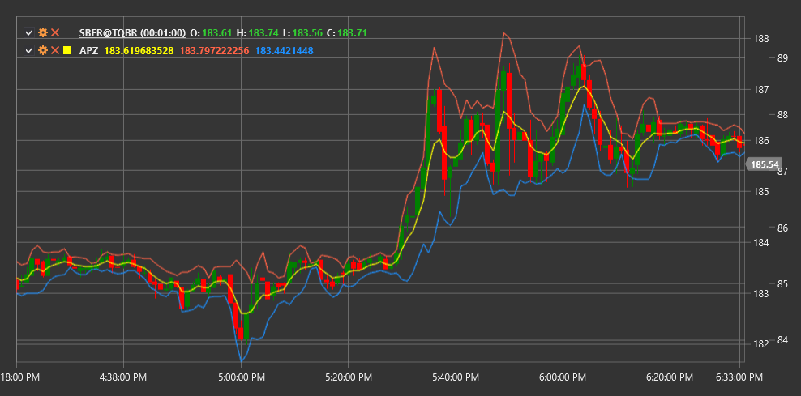

# APZ

**Adaptive Price Zone (APZ)** is a technical indicator developed by Lee Leibfarth that creates dynamic support and resistance zones, adapting to market volatility.

To use the indicator, you need to use the [AdaptivePriceZone](xref:StockSharp.Algo.Indicators.AdaptivePriceZone) class.

## Description

The APZ indicator consists of two lines (upper and lower) that form a price zone around the average price. This zone expands and contracts depending on the current market volatility. When the market becomes more volatile, the zone expands; when volatility decreases, the zone narrows.

APZ is particularly useful for:
- Identifying potential support and resistance levels
- Detecting possible trend reversal points
- Revealing periods of increased and decreased volatility
- Creating trading systems based on price zone breakouts

## Parameters

The indicator has the following parameters:
- **Period** - calculation period (default value: 5)
- **BandPercentage** - percentage of range to define band width (default value: 2%)

## Calculation

The APZ calculation is based on the Exponential Moving Average (EMA) and Average True Range (ATR):

1. First, calculate the EMA of price for the specified period:
   ```
   EMA = Exponential Moving Average of price over Period
   ```

2. Then calculate volatility using ATR:
   ```
   Volatility = Exponential Moving Average of ATR over Period
   ```

3. The upper and lower APZ lines are computed as follows:
   ```
   Upper Line = EMA + (Volatility * BandPercentage)
   Lower Line = EMA - (Volatility * BandPercentage)
   ```

When the price is above the upper APZ line, this can be considered an upward trend. When the price is below the lower APZ line, this may indicate a downward trend. When the price moves within the APZ zone, the market may be in a consolidation or sideways movement phase.



## See Also

[BollingerBands](bollinger_bands.md)
[KeltnerChannels](keltner_channels.md)
[DonchianChannels](donchian_channels.md)