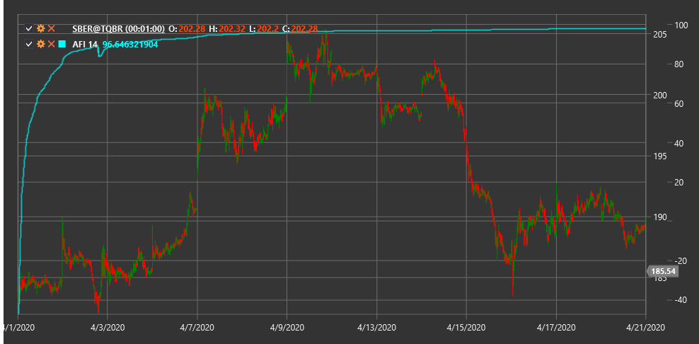

# AFI

**Approval Flow Index (AFI)** is an indicator that measures trend strength based on the relationship between volume and price movement.

To use the indicator, you need to use the [ApprovalFlowIndex](xref:StockSharp.Algo.Indicators.ApprovalFlowIndex) class.

## Description

The Approval Flow Index (AFI) helps assess the intensity of order flow in the market and determine the strength of the current trend. This indicator analyzes the relationship between trading volume and price movement to identify potential reversal points or confirm trend continuation.

The AFI indicator can be used for:
- Determining the strength of the current trend
- Identifying divergences between price and the indicator
- Searching for potential market reversal points

## Parameters

The indicator has the following parameters:
- **Length** - calculation period of the indicator

## Calculation

The Approval Flow Index calculation is based on analyzing price change and volume over a specific period:

1. First, calculate the price change for the period
2. Then relate this change to trading volume
3. The resulting values are summed over the selected period (Length parameter)

AFI aims to determine how much trading volume "approves" the price movement.

Positive AFI values indicate a strong upward trend, while negative values suggest a downward trend. Values close to zero may indicate the absence of a pronounced trend.

## See Also

[ADL](accumulation_distribution_line.md)
[OBV](obv.md)