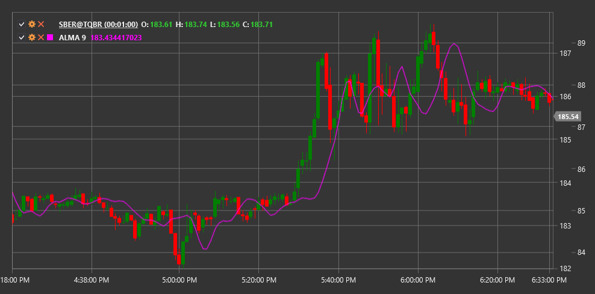

# ALMA

**Arnaud Legoux Moving Average (ALMA)** is an indicator developed by Arnaud Legoux and optimized to eliminate market noise and reduce signal lag.

To use the indicator, you need to use the [ArnaudLegouxMovingAverage](xref:StockSharp.Algo.Indicators.ArnaudLegouxMovingAverage) class.

## Description

ALMA combines the advantages of two data smoothing approaches:
1. Eliminating market noise (like most moving averages)
2. Minimizing lag (typical of many smoothing indicators)

The ALMA indicator uses a normal (Gaussian) distribution as a weight function, which can be fine-tuned using offset and sigma parameters. This makes it a very flexible and effective tool for technical analysis.

ALMA is used for:
- Determining the current trend
- Identifying reversal points
- Creating trading systems based on crossovers

## Parameters

The indicator has the following parameters:
- **Length** - calculation period (number of candles to analyze)
- **Sigma** - sigma, a parameter controlling the shape of the Gaussian curve (recommended value: 6)
- **Offset** - offset, a parameter controlling smoothing and response speed (recommended value: 0.85)

## Calculation

The ALMA calculation occurs in several stages:

1. Determining weights for each data point in the window based on normal (Gaussian) distribution:
   ```
   m = floor(Offset * (Length - 1))
   s = Length / Sigma
   
   For each i from 0 to Length-1:
   w(i) = exp(-((i - m)^2) / (2 * s^2))
   ```

2. Normalizing weights:
   ```
   Sum_of_weights = sum of all w(i)
   
   For each i from 0 to Length-1:
   w_norm(i) = w(i) / Sum_of_weights
   ```

3. Calculating ALMA as a weighted sum:
   ```
   ALMA = sum(Price(t-i) * w_norm(i)) for all i from 0 to Length-1
   ```

Where:
- Length - ALMA period
- Offset - offset parameter (from 0 to 1)
- Sigma - sigma parameter (usually from 2 to 8)



## See Also

[SMA](sma.md)
[EMA](ema.md)
[T3MA](t3_moving_average.md)
[ZLEMA](zero_lag_exponential_moving_average.md)