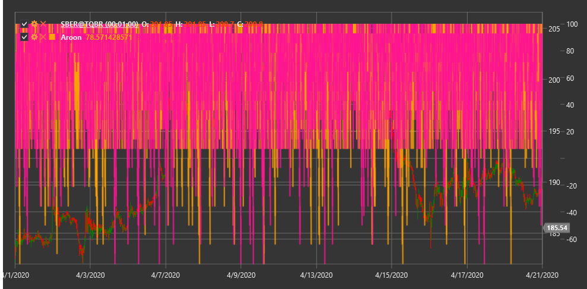

# Aroon

**Aroon Indicator** is a technical indicator developed by Tushar Chande in 1995 to identify trend changes and trend strength. The name "Aroon" comes from a Sanskrit word meaning "dawn of a new era".

To use the indicator, you need to use the [Aroon](xref:StockSharp.Algo.Indicators.Aroon) class.

## Description

The Aroon Indicator consists of two lines:
- **Aroon Up** - measures the strength of an upward trend
- **Aroon Down** - measures the strength of a downward trend

Aroon helps determine:
- The beginning of a new trend
- The strength of the current trend
- Consolidation and sideways movement
- Potential trend reversals

The indicator is particularly useful for identifying early stages of a new trend formation and for determining consolidation periods.

## Parameters

The indicator has the following parameters:
- **Length** - calculation period (typically 14-25 periods are used)

## Calculation

The Aroon Indicator calculation is based on determining the time (number of periods) elapsed since reaching the maximum and minimum prices within the specified period:

1. Aroon Up is calculated using the formula:
   ```
   Aroon Up = ((Length - Periods since high) / Length) * 100
   ```

2. Aroon Down is calculated using the formula:
   ```
   Aroon Down = ((Length - Periods since low) / Length) * 100
   ```

Where:
- Length - selected period
- "Periods since high" - number of periods since reaching the highest price within the Length period
- "Periods since low" - number of periods since reaching the lowest price within the Length period

Both Aroon lines oscillate between 0 and 100:
- A value of 100 means the high/low was reached in the most recent period
- A value of 0 means the high/low was reached Length periods ago

## Interpretation

- **Strong Upward Trend**: Aroon Up is close to 100, and Aroon Down is close to 0
- **Strong Downward Trend**: Aroon Down is close to 100, and Aroon Up is close to 0
- **Sideways Movement**: both lines move parallel to each other at low levels
- **Potential Trend Reversal**: crossing of Aroon Up and Aroon Down lines
- **Consolidation**: both lines oscillate around 50



## See Also

[ADX](adx.md)
[DMI](dmi.md)