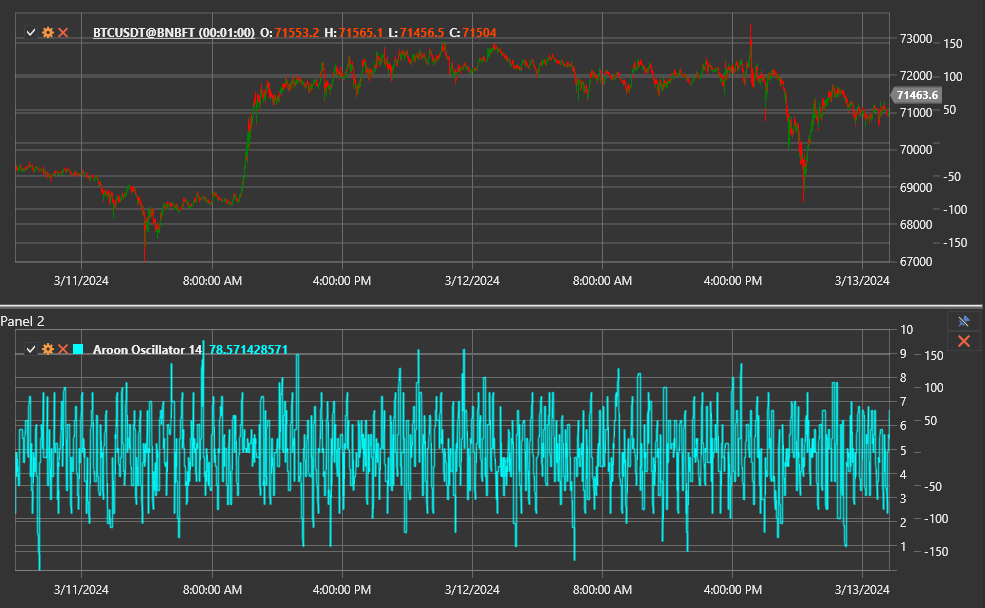

# Aroon Oscillator

The **Aroon Oscillator** measures the difference between the Aroon Up and Aroon Down lines. It highlights which side of the market
is dominant and how strong the current trend is.

Use the [AroonOscillator](xref:StockSharp.Algo.Indicators.AroonOscillator) class to work with this indicator.

## Description

The oscillator oscillates between −100 and +100:

- positive values show that Aroon Up is above Aroon Down and the market is dominated by buyers;
- negative values indicate that Aroon Down is leading and the bears are in control;
- readings around zero reflect balance or consolidation.

The further the value moves away from zero, the stronger the directional move.

## Parameters

- **Length** — period used for the underlying Aroon calculations. Larger values provide smoother readings with a slower response.

## Calculation

1. Calculate the Aroon Up and Aroon Down series with the selected `Length`.
2. Subtract the two lines:  
   `Aroon Oscillator = Aroon Up − Aroon Down`.

## Interpretation

- **Aroon Oscillator > 0** — bullish dominance.
- **Aroon Oscillator < 0** — bearish dominance.
- **Zero-line cross** — potential shift in the prevailing trend.
- **Extreme values** — strong directional trend, often used as a directional filter.

The oscillator is frequently analysed together with the base [Aroon](aroon.md) indicator to observe both absolute levels and their
difference.

## See also

[Aroon](aroon.md)
[ADX](adx.md)
[DMI](dmi.md)
