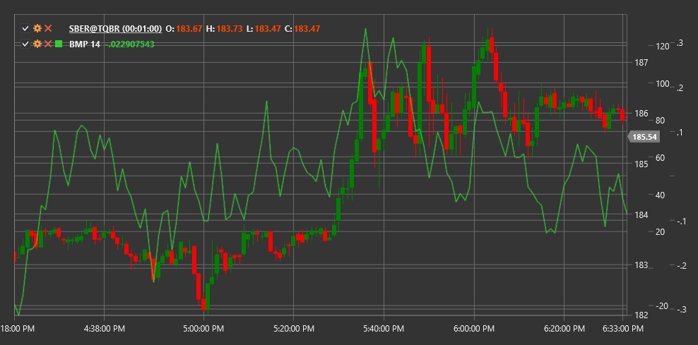

# BMP

**Balance of Market Power (BMP)** is an indicator that measures the strength of buyers relative to sellers, based on an analysis of price movements and trading volumes.

To use the indicator, you need to use the [BalanceOfMarketPower](xref:StockSharp.Algo.Indicators.BalanceOfMarketPower) class.

## Description

The Balance of Market Power indicator is designed to assess the current distribution of forces between buyers and sellers in the market. It analyzes how much the closing price deviates from its range (high-low) and correlates this with trading volume.

BMP helps traders:
- Determine the dominant market side (buyers or sellers)
- Identify potential trend reversals
- Detect divergences between price and the indicator
- Find overbought and oversold levels

## Parameters

The indicator has the following parameters:
- **Length** - smoothing period (default value: 14)

## Calculation

BMP calculation occurs in two stages:

1. Calculating BMP for each individual candle:
   ```
   Raw BMP = ((Close Price - Open Price) / (High - Low)) * Volume
   ```
   If (High - Low) is zero, the raw BMP is set to zero.

2. Smoothing BMP using a Simple Moving Average (SMA):
   ```
   BMP = SMA(Raw BMP, Length)
   ```

Where:
- Close Price - closing price of the current candle
- Open Price - opening price of the current candle
- High - highest price of the current candle
- Low - lowest price of the current candle
- Volume - trading volume for the current candle period
- Length - selected smoothing period

## Interpretation

- **Positive BMP values** indicate dominance of buyers (bulls) in the market
- **Negative BMP values** indicate dominance of sellers (bears) in the market
- **Crossing the zero line** can be considered a trend change signal
- **Extreme values** (above or below certain levels) may indicate market overbought or oversold conditions
- **Divergences** between BMP and price may signal a potential trend reversal



## See Also

[BalanceOfPower](balance_of_power.md)
[ForceIndex](force_index.md)
[ADL](accumulation_distribution_line.md)
[OBV](on_balance_volume.md)