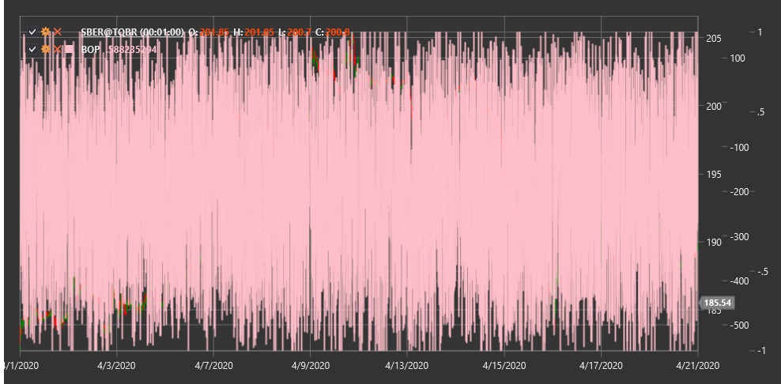

# BOP

**Balance of Power (BOP)** is an indicator designed to measure the strength of bulls (buyers) relative to bears (sellers) by evaluating the bulls' ability to raise the price from the low to the high.

To use the indicator, you need to use the [BalanceOfPower](xref:StockSharp.Algo.Indicators.BalanceOfPower) class.

## Description

The Balance of Power (BOP) indicator displays the balance of forces between buyers and sellers in the market. It is based on the assumption that in a trend, buyers (bulls) or sellers (bears) can control the price throughout the session. By comparing the difference between closing and opening prices with the full price range (high-low), the indicator allows assessment of who is currently dominating the market.

BOP helps traders:
- Determine the direction and strength of the current trend
- Identify potential reversal points
- Detect divergences between price and the indicator
- Determine overbought and oversold levels

## Calculation

The formula for calculating the Balance of Power (BOP) indicator is quite simple:

```
BOP = (Close - Open) / (High - Low)
```

Where:
- Close - closing price
- Open - opening price
- High - highest price for the period
- Low - lowest price for the period

If (High - Low) is zero, BOP is set to zero to avoid division by zero.

BOP is often additionally smoothed using a moving average to reduce volatility and improve signal readability.

## Interpretation

- **Positive BOP values** (above zero) indicate that buyers (bulls) are controlling the market, which may signal an upward trend.
- **Negative BOP values** (below zero) indicate that sellers (bears) are controlling the market, which may signal a downward trend.
- **Crossing the zero line** can be considered a signal of a potential trend direction change.
- **Extreme values** (strongly positive or strongly negative) may indicate market overbought or oversold conditions.
- **Divergences** between BOP and price can signal a possible trend reversal:
  - If the price is rising and BOP is falling, this may be a warning of a weakening upward trend.
  - If the price is falling and BOP is rising, this may indicate a potential end to the downward trend.



## See Also

[BalanceOfMarketPower](balance_of_market_power.md)
[ForceIndex](force_index.md)
[ADL](accumulation_distribution_line.md)
[OBV](obv.md)