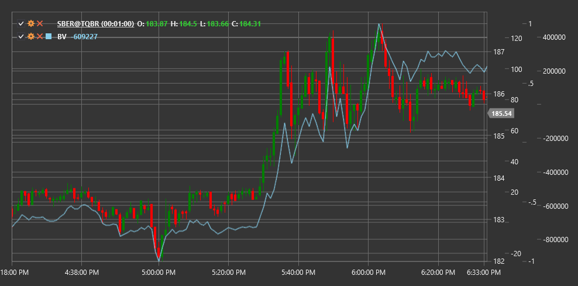

# BV

**Balance Volume (BV)** is a technical indicator that tracks the accumulation and distribution of trading volume based on price changes.

To use the indicator, you need to use the [BalanceVolume](xref:StockSharp.Algo.Indicators.BalanceVolume) class.

## Description

The Balance Volume (BV) indicator is designed to analyze the relationship between price change and trading volume. It helps traders determine how volume changes correspond to price movement, which can indicate the strength or weakness of the current trend.

The main idea of BV is that volume should confirm the price direction. If the price rises with increasing volume, this indicates a strong upward trend. Conversely, if the price falls with increasing volume, this suggests a strong downward trend.

The BV indicator is particularly useful for:
- Confirming the strength of the current trend
- Identifying potential trend reversals
- Detecting divergences between price and volume
- Determining accumulation and distribution levels

## Calculation

The Balance Volume indicator calculation is based on comparing the closing price with the previous closing price and weighting the trading volume:

```
If Close > Previous Close:
	BV = Previous BV + Volume
If Close < Previous Close:
	BV = Previous BV - Volume
If Close = Previous Close:
	BV = Previous BV
```

Where:
- Close - current closing price
- Previous Close - previous closing price
- Volume - current trading volume
- Previous BV - previous Balance Volume indicator value

## Interpretation

- **BV rising with price increase** - confirmation of an upward trend, indicates strong buyer interest
- **BV falling with price decrease** - confirmation of a downward trend, indicates strong seller interest
- **BV rising with stable or falling price** - potential accumulation, may precede an upward reversal
- **BV falling with stable or rising price** - potential distribution, may precede a downward reversal
- **Divergence between BV and price** - warning of a possible trend reversal:
  - If price rises while BV falls, a quick downward reversal may be imminent
  - If price falls while BV rises, a quick upward reversal may be imminent



## See Also

[OBV](on_balance_volume.md)
[ADL](accumulation_distribution_line.md)
[ChaikinMoneyFlow](chaikin_money_flow.md)
[ForceIndex](force_index.md)