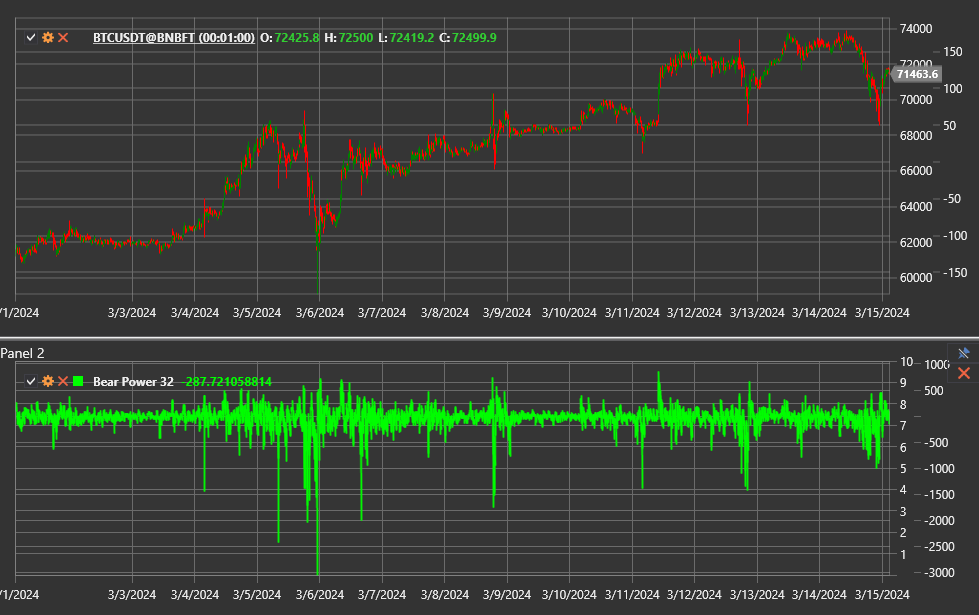

# Bear Power

**Bear Power** is part of Alexander Elder's Elder-ray system and shows how strong the sellers are compared with an exponential
moving average (EMA). It measures how far the intraday lows fall below the average price and highlights moments when the bears lose
control.

Use the [BearPower](xref:StockSharp.Algo.Indicators.BearPower) class to access the indicator.

## Description

The indicator is calculated as the difference between the bar low and the EMA value:

`Bear Power = Low − EMA`.

- Negative readings confirm selling pressure.
- Rising values toward zero or above zero indicate weakening bears and a possible bullish reversal.
- Deep troughs often precede rebounds, especially during panicky sell-offs.

## Parameters

Bear Power inherits the configuration of [ExponentialMovingAverage](xref:StockSharp.Algo.Indicators.ExponentialMovingAverage):

- **Length** — EMA period.
- **Alpha** (optional) — smoothing coefficient if the EMA is configured this way.

## Usage

- Look for reversals when Bear Power turns upward after an extreme low while the EMA starts to rise.
- Crossing the zero line may confirm a change in the prevailing trend.
- Combine Bear Power with [Bull Power](bull_power.md) and the price EMA to build the full [Elder Ray](elder_ray.md) indicator.

## See also

[Bull Power](bull_power.md)
[Elder Ray](elder_ray.md)
[ExponentialMovingAverage](ema.md)
